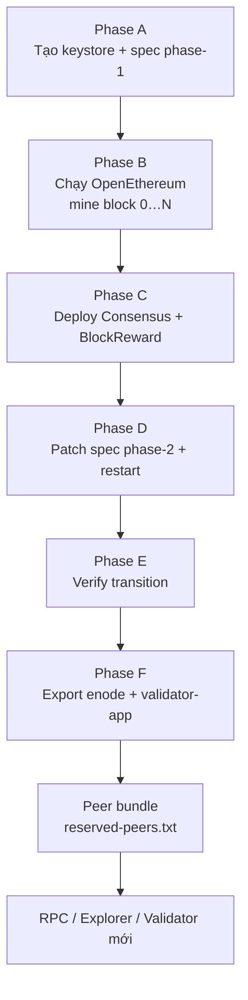
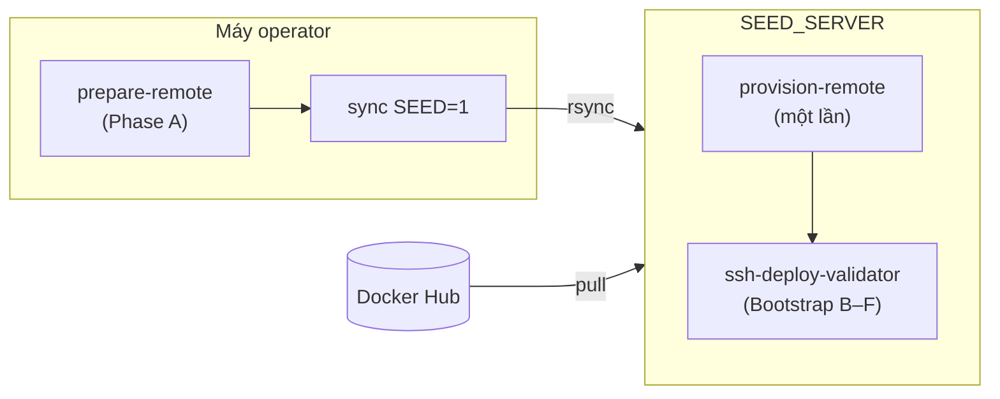

# Deploy seed node từ đầu đến cuối

Hướng dẫn operator **triển khai seed node (validator-1)** trên source hiện tại của repo `blockchain-dock`, từ clone repo → cấu hình → build images → bootstrap chain → verify → lưu peer bundle.

> Trong repo này, **seed node = validator-1** — node đầu tiên khởi tạo chain, deploy smart contracts, và cung cấp enode bootstrap cho mọi node khác (RPC, explorer, validator phụ). Chain DPoS **không dùng bootnode**; các node non-seed peer qua `genesis/reserved-peers.txt`.

**Tài liệu liên quan (chi tiết từng phần):**

| Tài liệu | Khi nào đọc thêm |
|----------|------------------|
| [dpos.md](./dpos.md) | Kiến trúc DPoS, hai pha spec |
| [dpos-testnet.md](./dpos-testnet.md) | Chi tiết từng Phase A–F, biến env, troubleshooting sâu |
| [remote-deploy.md](./remote-deploy.md) | Remote deploy đa server, sync bundle |
| [custom-staking-gtbs.md](./custom-staking-gtbs.md) | Bật GTBS custom staking |
| [validator-1-custom-contracts.md](./validator-1-custom-contracts.md) | Runbook GTBS trên server |
| [setup-new-validator-remote.md](./setup-new-validator-remote.md) | Thêm validator-2, validator-3… sau seed |
| [reset-seed-redeploy-local.md](./reset-seed-redeploy-local.md) | Reset chain cũ và deploy lại |
| [makefile.md](../../docs/makefile.md) | Map lệnh `make` |

---

## Tổng quan

### Seed node làm gì?



| Phase | Mục đích | Chạy ở đâu |
|-------|----------|------------|
| A | Sinh keystore validator-1, `genesis/spec.json` phase-1 | **Máy operator** (local) |
| B–F | Bootstrap chain, deploy contracts, patch spec, verify | **Seed host** (local hoặc remote) |
| Sau F | Export enode → `genesis/reserved-peers.txt` | **Seed host** |

> **Ràng buộc quan trọng:** Phase C + D phải hoàn tất **trước** khi `current_block >= CONTRACT_TRANSITION_BLOCK`. Nếu quá block transition mà chưa patch spec → phải tạo chain mới.

### Hai luồng deploy

| Luồng | Môi trường | Images | Khuyến nghị |
|-------|------------|--------|-------------|
| **A — Local** | Một máy dev/test | Build local (`make build`) | Dev, smoke test |
| **B — Remote** | Operator + `SEED_SERVER` | Docker Hub (`make build push`) | Production / testnet public |

Cả hai luồng dùng chung file cấu hình `envs/deploy.env` và cùng bộ script trong `blockchain-dockerize/docker-compose/chain-dpos/`.

---

## Yêu cầu hệ thống

### Repo

Clone **full monorepo** (cần cả hai thư mục):

```
blockchain-dock/
├── blockchain-docker-base/          # Docker images, dpos-contracts, custom-staking
└── blockchain-dockerize/
    └── docker-compose/chain-dpos/   # Thư mục làm việc chính
```

### Phần mềm

| Thành phần | Máy operator | Seed server (remote) |
|------------|--------------|----------------------|
| Docker 20.10+ | Có (build images) | **Bắt buộc** |
| Docker Compose v2 | Có | **Bắt buộc** |
| Node.js 18+ | **Bắt buộc** (genesis) | Không (remote không clone git) |
| `jq`, `curl`, `rsync`, `ssh` | **Bắt buộc** | `jq`, `curl` (provision tự cài) |
| GNU Make 4+ | Khuyến nghị | Khuyến nghị |

Kiểm tra nhanh:

```bash
cd blockchain-dock
make check
```

### Phần cứng seed server (production)

| Thông số | Khuyến nghị |
|----------|-------------|
| CPU | 4 vCPU |
| RAM | 8–16 GB |
| Disk | 150 GB SSD (chain DB tăng theo thời gian) |
| OS | Ubuntu 20.04+ |

### Cổng mạng

| Cổng | Giao thức | Mục đích |
|------|-----------|----------|
| **30300** | TCP/UDP | P2P OpenEthereum — **mở public** nếu có validator/RPC peer từ server khác |
| **8545** | TCP | JSON-RPC — chỉ `127.0.0.1` trên seed host; public qua RPC node riêng |
| **22** | TCP | SSH operator |
| **80, 443** | TCP | Traefik (nếu chạy DApps trên seed — không khuyến nghị production) |

---

## Bước 1 — Cấu hình `deploy.env`

Tất cả tham số chain, contract, Docker Hub, SSH target, domain Traefik nằm trong **một file**:

```bash
cd blockchain-dock
make dpos init    # copy envs/deploy.env.example → envs/deploy.env (lần đầu)
```

Chỉnh `blockchain-dockerize/docker-compose/chain-dpos/envs/deploy.env`:

### Chain identity (bắt buộc)

| Biến | Ghi chú |
|------|---------|
| `NETWORK_NAME` | Tên chain (vd. `GTBS`, `DPOS-Testnet`) |
| `NETWORK_ID` | Chain ID hex, vd. `0x11F7` — **phải unique** |
| `NETWORK_TYPE` | `testnet` hoặc `mainnet` |
| `BLOCK_TIME_SECONDS` | Block time (vd. `3` hoặc `5`) |
| `CONTRACT_TRANSITION_BLOCK` | Block chuyển sang contract consensus — đủ lớn để deploy + patch kịp (≥ 100 với block time 5s) |
| `PREMINE_ADDRESS` | Treasury genesis — **phải khác** địa chỉ validator-1 (tự sinh ở Phase A) |
| `PREMINE_BALANCE_WEI` | Số dư premine treasury |
| `VALIDATOR_BALANCE_WEI` | Số dư validator-1; cần đủ lớn **nếu bật EIP-1559** và deploy sau London |

### Contract economics

| Biến | Ghi chú |
|------|---------|
| `DECIMALS`, `MIN_STAKE_TOKENS`, `MAX_STAKE_TOKENS` | Tham số staking |
| `CYCLE_DURATION_SECONDS`, `INFLATION_PERCENT` | Consensus cycle |

### Remote deploy (luồng B)

```env
DOCKERHUB_NAMESPACE=your-dockerhub-username
REMOTE_DEPLOY_DIR=/opt/blockchain-gtbs
SEED_SERVER=ubuntu@91.229.245.75
OPEN_P2P_PORT=true
P2P_PUBLIC_IP=91.229.245.75
P2P_PORT=30300
```

### GTBS custom staking (tuỳ chọn)

```env
ENABLE_CUSTOM_STAKING=true
MAX_SUPPLY_WEI=3000000000000000000000000000
# + các biến GTBS khác — xem custom-staking-gtbs.md
```

### Traefik / domains (nếu deploy DApps trên seed)

Điền `ACME_EMAIL`, `RPC_SERVER_NAME`, `EXPLORER_SERVER_NAME`, `STATS_SERVER_NAME`, `VISUALIZE_SERVER_NAME`, `STATUS_SERVER_NAME`, `FAUCET_SERVER_NAME` (testnet), `DOCS_SERVER_NAME`.

### Checklist trước khi tiếp tục

- [ ] `NETWORK_ID` đúng định dạng `0x...`
- [ ] `PREMINE_ADDRESS` ≠ địa chỉ validator (sẽ sinh ở Phase A)
- [ ] `CONTRACT_TRANSITION_BLOCK` đủ buffer
- [ ] `DOCKERHUB_NAMESPACE` đã set (luồng B)
- [ ] `SEED_SERVER` + `REMOTE_DEPLOY_DIR` đã set (luồng B)
- [ ] DNS trỏ về server (nếu dùng Traefik)
- [ ] Không commit `deploy.env` thật lên git

---

## Bước 2 — Build Docker images

### Luồng A — Local (images local)

```bash
cd blockchain-dock

# Chain core — bắt buộc cho seed
make build build-chain

# Nếu deploy full DApps trên cùng máy
make build build-explorer
make build build-dapps
```

Để `DOCKERHUB_NAMESPACE` trống hoặc placeholder — compose dùng tag local (`openethereum:0.0.1`, …).

### Luồng B — Remote (Docker Hub)

```bash
cd blockchain-dock
make build login
make build push DOCKERHUB_NAMESPACE=your-dockerhub-username
```

Hoặc push từng nhóm:

```bash
make build push-chain DOCKERHUB_NAMESPACE=youruser
make build push-explorer DOCKERHUB_NAMESPACE=youruser
make build push-dapps DOCKERHUB_NAMESPACE=youruser
```

Nếu bật GTBS và sửa contract, rebuild deployer:

```bash
docker build \
  -f blockchain-docker-base/docker/Dockerfile.dpos-deployer \
  -t dpos-deployer:0.0.1 \
  blockchain-docker-base
# Rồi push lại qua make build push-chain
```

Chi tiết image: [`blockchain-docker-base/README.md`](../../blockchain-docker-base/README.md).

---

## Bước 3 — Chuẩn bị genesis (Phase A) — máy operator

Phase A **luôn chạy trên máy operator** (có Node.js), kể cả deploy remote.

### Chain chuẩn

```bash
cd blockchain-dock
make dpos prepare-remote
# Có Traefik domains:
make dpos prepare-remote WITH_TRAEFIK=1
```

### GTBS custom staking

```bash
make dpos gtbs-prepare WITH_TRAEFIK=1
```

Script thực hiện:

1. `render-envs.sh` — sinh `envs/dpos.chain.env`, `envs/dpos.contract.env`, secrets…
2. (GTBS) compile + test contracts, validate tokenomics
3. `prepare-genesis.sh` — keystore validator-1, `genesis/spec.json` phase-1

**Artifacts sau Phase A:**

```
genesis/
├── spec.json              # phase-1 (chưa có safeContract)
├── spec.phase-1.json
└── validator-1.address    # ghi lại địa chỉ validator

nodes/validator-1/
├── config.toml
├── keystore/              # UTC--* (BẢO MẬT — backup!)
└── node.pwd
```

```bash
cat blockchain-dockerize/docker-compose/chain-dpos/genesis/validator-1.address
```

> **Backup ngay:** `genesis/`, `nodes/validator-1/keystore/`, `nodes/validator-1/node.pwd` — mất keystore = mất quyền validator vĩnh viễn.

---

## Luồng A — Deploy seed trên local

Dùng khi dev, smoke test, hoặc thử chain mới trên một máy.

### A.1 — Deploy chỉ chain (validator-1)

```bash
cd blockchain-dock
make dpos deploy CHAIN_ONLY=1
```

Tương đương: `render-envs` → `bootstrap-chain.sh` (Phase A–F) → start `validator-app`.

### A.2 — Deploy full stack (chain + RPC + Blockscout + Traefik)

Cần DNS hoặc `/etc/hosts` trỏ domain về máy local:

```bash
make dpos deploy WITH_TRAEFIK=1
```

### A.3 — Chạy script trực tiếp

```bash
cd blockchain-dockerize/docker-compose/chain-dpos
./scripts/deploy-all.sh --chain-only
# hoặc:
./scripts/deploy-all.sh --with-traefik
```

### A.4 — Verify local

```bash
cd blockchain-dockerize/docker-compose/chain-dpos
./scripts/health-check.sh

curl -s -X POST http://127.0.0.1:8545 \
  -H 'Content-Type: application/json' \
  -d '{"jsonrpc":"2.0","method":"eth_blockNumber","params":[],"id":1}' | jq

make dpos enode    # từ repo root
```

---

## Luồng B — Deploy seed lên server remote (production)

Đây là luồng khuyến nghị cho testnet/mainnet public.



### B.1 — SSH key (một lần)

```bash
ssh-keygen -t ed25519 -C "$(whoami)@$(hostname)"   # nếu chưa có
make dpos setup-ssh SEED=1
# Kiểm tra:
ssh -o BatchMode=yes $(grep SEED_SERVER blockchain-dockerize/docker-compose/chain-dpos/envs/deploy.env | cut -d= -f2) "echo ok"
```

### B.2 — Provision server (một lần)

Cài Docker, Compose v2, Node 18+, `jq`, `curl`, `rsync`:

```bash
make dpos provision-remote SEED=1
```

Hoặc trên server sau khi SSH:

```bash
sudo /opt/blockchain-gtbs/blockchain-dockerize/docker-compose/chain-dpos/scripts/remote/provision-server.sh
```

### B.3 — Sync bundle lên seed server

Sau `prepare-remote` (Phase A xong trên operator):

```bash
make dpos sync SEED=1
```

Đồng bộ: genesis, keystore, env files, compose, scripts, `dpos-contracts/`.  
**Không** sync `nodes/*/data/` (chain DB tạo mới trên server).

### B.4 — Deploy validator trên seed server

Từ máy operator (qua SSH):

```bash
make dpos ssh-deploy-validator SEED=1 WITH_TRAEFIK=1
```

Hoặc SSH vào server rồi chạy:

```bash
cd /opt/blockchain-gtbs/blockchain-dockerize/docker-compose/chain-dpos
make deploy-remote-validator WITH_TRAEFIK=1
```

Script `deploy-validator.sh` tự động:

1. `render-envs.sh` + pull images từ Docker Hub
2. `bootstrap-chain.sh --skip-genesis` (Phase B–F)
3. Start `openethereum` + `netstats-api` + `validator-app`
4. Mở P2P firewall (nếu `OPEN_P2P_PORT=true`)
5. `export-peer-config.sh` — sinh peer bundle

**Chỉ chain, không DApps trên seed:**

```bash
make dpos ssh-deploy-validator SEED=1
# (bỏ WITH_TRAEFIK=1)
```

**Khởi động lại sau khi đã bootstrap:**

```bash
make dpos ssh-deploy-validator SEED=1 SKIP_BOOTSTRAP=1
```

### B.5 — Verify trên seed server

```bash
ssh <SEED_SERVER>
cd /opt/blockchain-gtbs/blockchain-dockerize/docker-compose/chain-dpos

./scripts/health-check.sh
./scripts/verify-contracts-transition.sh

curl -s -X POST http://127.0.0.1:8545 \
  -H 'Content-Type: application/json' \
  -d '{"jsonrpc":"2.0","method":"eth_blockNumber","params":[],"id":1}' | jq

docker ps --filter name=dpos
cat genesis/validator-1.enode
cat genesis/reserved-peers.txt
```

GTBS thêm:

```bash
./scripts/validate-tokenomics.sh
```

---

## Bước 4 — Lưu peer bundle (sau seed deploy thành công)

Peer bundle cho phép RPC node, explorer, validator mới kết nối P2P tới seed.

| File | Mục đích |
|------|----------|
| `genesis/reserved-peers.txt` | Enode bootstrap (một dòng) |
| `genesis/validator-1.enode` | Enode seed validator |
| `genesis/peers/seed.enode` | Bản sao enode |
| `genesis/contract-addresses.json` | Địa chỉ contracts sau deploy |
| `genesis/spec.json` | Spec phase-2 (có `safeContract`) |
| `genesis/flats/` | GTBS: flattened contracts (Blockscout verify) |
| `genesis/gtbs-deploy-manifest.json` | GTBS: initialize params + địa chỉ proxy |

### Remote: kéo bundle về operator và commit

```bash
cd blockchain-dock
make dpos pull-peer-config

git add blockchain-dockerize/docker-compose/chain-dpos/genesis/reserved-peers.txt \
        blockchain-dockerize/docker-compose/chain-dpos/genesis/validator-1.enode \
        blockchain-dockerize/docker-compose/chain-dpos/genesis/peers/ \
        blockchain-dockerize/docker-compose/chain-dpos/genesis/contract-addresses.json \
        blockchain-dockerize/docker-compose/chain-dpos/genesis/spec.json \
        blockchain-dockerize/docker-compose/chain-dpos/genesis/flats/ \
        blockchain-dockerize/docker-compose/chain-dpos/genesis/gtbs-deploy-manifest.json
```

> Chỉ cần `pull-peer-config` **một lần** sau seed deploy đầu tiên, trừ khi seed đổi IP hoặc enode thay đổi.

### Đẩy bundle lên server non-seed

```bash
make dpos sync-peer-bundle EXPLORER=1
# hoặc validator mới:
make dpos sync-peer-bundle SERVER=ubuntu@validator-2-host
```

Tiếp theo: [setup-new-validator-remote.md](./setup-new-validator-remote.md) hoặc [deploy-explorer-server-3.md](./deploy-explorer-server-3.md).

---

## Bước 5 — DApps trên seed (tuỳ chọn)

**Production khuyến nghị:** tách DApps khỏi seed:

| Server | Vai trò |
|--------|---------|
| `SEED_SERVER` | Chỉ validator-1 + netstats-api |
| `EXPLORER_SERVER` | RPC archive + Blockscout v11 |
| `DAPPS_SERVER` | Netstats dashboard, docs, faucet, Traefik |

Nếu vẫn chạy DApps trên seed (dev/single-server):

```bash
# Local:
make dpos deploy WITH_TRAEFIK=1

# Remote — sau khi validator đã chạy:
make dpos ssh-deploy-dapps SEED=1
# hoặc explorer riêng:
make dpos ssh-deploy-explorer EXPLORER=1
```

Build images explorer trước: [explorer-v11.md](./explorer-v11.md).

---

## Checklist deploy production

| # | Việc | Lệnh / kiểm tra |
|---|------|-----------------|
| 1 | Clone full repo | `blockchain-docker-base` + `blockchain-dockerize` |
| 2 | Cấu hình `deploy.env` | `make dpos init` → chỉnh |
| 3 | Push images Docker Hub | `make build push DOCKERHUB_NAMESPACE=...` |
| 4 | Phase A genesis | `make dpos prepare-remote` hoặc `gtbs-prepare` |
| 5 | SSH key + provision | `setup-ssh` → `provision-remote SEED=1` |
| 6 | Sync bundle | `make dpos sync SEED=1` |
| 7 | Deploy seed | `make dpos ssh-deploy-validator SEED=1` |
| 8 | Verify transition | `verify-contracts-transition.sh` |
| 9 | Pull peer bundle | `make dpos pull-peer-config` |
| 10 | Mở P2P 30300 | `OPEN_P2P_PORT=true` (tự mở khi deploy) |
| 11 | Backup keystore | `nodes/validator-1/keystore/` off-site |
| 12 | Deploy explorer / validator phụ | `sync-peer-bundle` → docs tương ứng |

---

## Troubleshooting nhanh

| Triệu chứng | Nguyên nhân | Cách xử lý |
|-------------|-------------|------------|
| `prepare-deploy.sh`: thiếu `DOCKERHUB_NAMESPACE` | Chưa set namespace | Sửa `deploy.env` (luồng B) |
| `prepare-genesis.sh` exit 1 | `PREMINE_ADDRESS` = validator | Đổi `PREMINE_ADDRESS` |
| RPC không phản hồi sau deploy | Container crash | `docker logs dpos-*-validator-1` |
| Deployer "too late" | Block > `CONTRACT_TRANSITION_BLOCK` | Reset chain, tăng transition block |
| `getValidators()` empty | Spec chưa patch | Xem lại Phase D, `genesis/spec.json` |
| Peer không sync | P2P 30300 bị chặn | `ufw status`, `OPEN_P2P_PORT=true` |
| Enode sai IP | NAT / public IP | Set `P2P_PUBLIC_IP` trong `deploy.env` |
| Remote pull image fail | Sai namespace / chưa push | `docker login`, kiểm tra `DOCKERHUB_NAMESPACE` |

Chi tiết thêm: [dpos-testnet.md § Troubleshooting](./dpos-testnet.md#14-troubleshooting).

---

## Tóm tắt lệnh theo luồng

### Local (dev)

```bash
cd blockchain-dock
make dpos init
# chỉnh envs/deploy.env
make build build-chain
make dpos prepare-remote
make dpos deploy CHAIN_ONLY=1
make dpos health
make dpos enode
```

### Remote (production)

```bash
cd blockchain-dock
make dpos init
# chỉnh envs/deploy.env (DOCKERHUB_NAMESPACE, SEED_SERVER, …)
make build push DOCKERHUB_NAMESPACE=youruser
make dpos prepare-remote WITH_TRAEFIK=1
make dpos setup-ssh SEED=1
make dpos provision-remote SEED=1
make dpos sync SEED=1
make dpos ssh-deploy-validator SEED=1
make dpos pull-peer-config
```

### GTBS (thay `prepare-remote` → `gtbs-prepare`)

```bash
make dpos gtbs-prepare WITH_TRAEFIK=1
make dpos sync SEED=1
make dpos ssh-deploy-validator SEED=1
```

---

## Sau khi seed chạy ổn

1. **Commit peer bundle** vào repo (hoặc secret store nội bộ).
2. **Deploy explorer** — [deploy-explorer-server-3.md](./deploy-explorer-server-3.md).
3. **Thêm validator** — [setup-new-validator-remote.md](./setup-new-validator-remote.md).
4. **Monitor** — netstats dashboard, disk usage chain DB.
5. **Reset chain** (nếu cần) — [reset-seed-redeploy-local.md](./reset-seed-redeploy-local.md).
