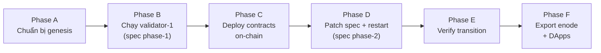

# Hướng dẫn triển khai Chain DPoS (Testnet / Deploy mới)

Tài liệu operator chi tiết để **tạo và deploy chain DPoS mới** từ đầu. Xem tổng quan kiến trúc tại [dpos.md](./dpos.md).

> **Runbook seed node end-to-end (local + remote):** [deploy-seed-node.md](./deploy-seed-node.md).

## Tổng quan luồng deploy

Chain DPoS dùng **hai pha spec** (theo mô hình Fuse Network):



| Phase | Mục đích | Script / lệnh | Make (từ repo root) |
|-------|----------|---------------|---------------------|
| A | Tạo keystore validator, spec phase-1 (validator list tĩnh, chưa có contract) | `prepare-genesis.sh` | `make dpos genesis` |
| B | Khởi động OpenEthereum, chain mine block 0…N | `compose-validator-1.yml up` | `make dpos validator-up` |
| C | Deploy Consensus + BlockReward qua RPC (ký bằng validator-1) | `compose-deploy-contracts.yml` | _(trong `bootstrap` / `deploy`)_ |
| D | Gắn địa chỉ contract vào spec, restart node | `patch-spec-after-deploy.sh`, `restart-validator-1.sh` | `make dpos patch-spec` → `make dpos validator-restart` |
| E | Chờ block ≥ `CONTRACT_TRANSITION_BLOCK`, verify on-chain | `verify-contracts-transition.sh` | `make dpos verify` |
| F | Xuất enode, bật validator-app / DApps (tuỳ chọn) | `get_enode.sh`, `compose-dapps-traefik-v11.yml` | `make dpos enode` → `make dpos dapps-up` |

> Chi tiết Makefile: [makefile.md](./makefile.md).

> **Ràng buộc thời gian quan trọng:** Phase C + D phải hoàn tất **trước** khi `current_block >= CONTRACT_TRANSITION_BLOCK`. Nếu quá block transition mà chưa patch spec, phải tạo chain mới.

---

## Quick start (config-driven v2)

Luồng rút gọn: một file cấu hình → bootstrap chain + RPC archive + explorer v11.

```bash
cd blockchain-dockerize/docker-compose/chain-dpos
cp envs/deploy.env.example envs/deploy.env
# Chỉnh NETWORK_NAME, NETWORK_ID, PREMINE_ADDRESS, domains (EXPLORER/STATS/VISUALIZE/RPC), ACME_EMAIL
./scripts/deploy-all.sh --with-traefik
```

**Makefile (từ root monorepo `blockchain-dock/`):**

```bash
make dpos init
# chỉnh blockchain-dockerize/docker-compose/chain-dpos/envs/deploy.env
make dpos deploy WITH_TRAEFIK=1
```

| Flag script | Biến Make tương đương |
|-------------|----------------------|
| `--chain-only` | `make dpos deploy CHAIN_ONLY=1` |
| `--dapps-only` | `make dpos deploy-dapps` |
| `--with-traefik` | `WITH_TRAEFIK=1` |
| `--skip-health` | `SKIP_HEALTH=1` |

**Deploy lên server qua Docker Hub (không clone git trên server):** xem **[remote-deploy.md](./remote-deploy.md)** — `prepare-deploy.sh` local → `sync-to-server.sh` → `deploy-validator.sh` / `deploy-dapps.sh` trên server.

| Flag | Ý nghĩa |
|------|---------|
| `--chain-only` | Chỉ Phase A–F (validator-1), không bật DApps |
| `--dapps-only` | Bỏ qua bootstrap; giả định chain đã chạy |
| `--with-traefik` | Render domains bắt buộc + Traefik dynamic v11 |
| `--skip-health` | Bỏ qua `health-check.sh` |

**Thành phần mới so với v1:**

- **RPC node riêng** (`nodes/rpc/config.toml`) — archive, peer tới validator-1 enode; Blockscout đọc RPC qua `rpc.host`.
- **Blockscout v11** — backend 11.2.1 + frontend 2.8.1 + stats + visualizer (3 hostname Traefik).
- **Faucet** — chỉ `NETWORK_TYPE=testnet`; wallet tự sinh (`genesis/faucet-wallet.export`).

Build images v11 trước khi deploy (xem [explorer-v11.md](./explorer-v11.md)).

### Validator-2 (server remote)

`deploy-all.sh` **không** tự thêm validator thứ hai. Dùng guide đầy đủ:

**[setup-new-validator-remote.md](./setup-new-validator-remote.md)** — `make prepare-new-validator-local` → `sync-new-validator` → `ssh-new-validator-prepare` → `ssh-new-validator-up` → `add-peer-enode` trên seed.

### Di chuyển validator-1 sang server khác (outline)

1. Dừng validator-1, backup `nodes/validator-1/data/` và `nodes/validator-1/keystore/`.
2. Restore trên host mới; cập nhật P2P port/firewall.
3. Trên **rpc-node**, cập nhật `nodes/rpc/reserved-peers.txt` (hoặc chạy lại `prepare-rpc-node.sh`) với enode validator-1 mới.
4. Restart rpc-node + kiểm tra sync (`./scripts/health-check.sh`).

---

## 0. Yêu cầu hệ thống

### Phần mềm

| Thành phần | Phiên bản tối thiểu |
|------------|---------------------|
| Docker | 20.10+ |
| Docker Compose | v2 (`docker compose`) |
| Node.js | 18+ (chạy script genesis trên host) |
| `curl`, `jq` | Dùng verify / export enode |

### Phần cứng (validator-1)

| Thông số | Khuyến nghị |
|----------|-------------|
| CPU | 2–4 vCPU |
| RAM | 8–16 GB |
| Disk | 150 GB SSD (archive node) |
| OS | Ubuntu 20.04+ hoặc Linux tương đương |

### Cổng mạng

| Cổng | Giao thức | Mục đích | Ghi chú |
|------|-----------|----------|---------|
| 30300 | TCP/UDP | P2P OpenEthereum | Mở public nếu có validator-2 peer |
| 8545 | TCP | JSON-RPC HTTP | Validator: chỉ `127.0.0.1` trên host (không public). RPC node public qua Traefik |
| 3006 | TCP | Netstats API | Nội bộ |
| 80/443 | TCP | Traefik (DApps) | Khi deploy explorer, faucet, status |

### Repo cần có

```
blockchain-dock/
├── blockchain-docker-base/     # Build images + dpos-contracts
└── blockchain-dockerize/
    └── docker-compose/chain-dpos/   # Thư mục làm việc chính
```

---

## 1. Build Docker images

Chạy từ thư mục `blockchain-docker-base`:

```bash
cd blockchain-docker-base

# Chain core (validator, deployer, netstats-api trên node)
./scripts/build-and-push.sh --chain

# Blockscout explorer v11 (+ legacy nếu cần)
./scripts/build-and-push.sh --explorer

# DApps còn lại (netstats dashboard, faucet testnet, docs)
./scripts/build-and-push.sh --dapps

# Hoặc build tất cả
./scripts/build-and-push.sh
```

Từ root monorepo:

```bash
make build build-chain
make build build-explorer
make build build-dapps
make build
```

Chi tiết nhóm image: [`blockchain-docker-base/README.md`](../../blockchain-docker-base/README.md).

> **Lưu ý:** Validator `[rpc] hosts/interface = "all"` **trong container** — cho phép Docker chuyển tiếp từ host; **không** mở RPC ra internet. Lớp bảo vệ là compose map **`127.0.0.1:8545:8545`** trên host (xem `overrides/validator-1.override.yml`). Deployer / netstats gọi RPC qua hostname Docker **`openethereum:8545`** (cùng network); `validator-app` dùng chung network namespace với node.

---

## 2. Chuẩn bị biến môi trường

```bash
cd blockchain-dockerize/docker-compose/chain-dpos

cp envs/dpos.chain.env.example envs/dpos.chain.env
cp envs/dpos.contract.env.example envs/dpos.contract.env
```

> `prepare-genesis.sh` cũng tự copy từ `.example` nếu file chưa tồn tại, rồi **dừng** để bạn chỉnh giá trị trước khi chạy lại.

### 2.1 `envs/dpos.chain.env` — cấu hình chain

| Biến | Bắt buộc | Mô tả |
|------|----------|-------|
| `NETWORK_NAME` | Có | Tên hiển thị chain; dùng làm thư mục keystore trong container (`/app/data/keys/${NETWORK_NAME}`) |
| `NETWORK_ID` | Có | Chain ID dạng hex, ví dụ `0x3a1` (= 929) |
| `NETWORK_TYPE` | Có | `testnet` hoặc `mainnet` — quyết định tên container (`dpos-${NETWORK_TYPE}-validator-1`) |
| `BLOCK_TIME_SECONDS` | Có | Thời gian block (AuthorityRound `stepDuration`) |
| `CONTRACT_TRANSITION_BLOCK` | Có | Block chuyển sang consensus contract; deploy + patch phải xong trước block này |
| `PREMINE_ADDRESS` | Có | Địa chỉ treasury; **phải khác** `VALIDATOR_1_ADDRESS` (tự sinh ở Phase A) |
| `PREMINE_BALANCE_WEI` | Có | Số dư genesis của treasury (wei) |
| `VALIDATOR_BALANCE_WEI` | Có | Số dư genesis validator-1. Chỉ cần lớn khi deploy xảy ra **sau** `EIP1559_TRANSITION_BLOCK` (ví dụ `EIP1559_TRANSITION_BLOCK=0` hoặc `< CONTRACT_TRANSITION_BLOCK` nhưng deploy chậm). Nếu `EIP1559_TRANSITION_BLOCK > CONTRACT_TRANSITION_BLOCK` thì deploy zero-gas |
| `INITIAL_SUPPLY_GWEI` | Có | Truyền vào `BlockReward.initialize` khi deploy |
| `ENABLE_EIP1559` | Không | `true` để bật London/EIP-1559 trong `spec.json` (mặc định tắt) |
| `EIP1559_TRANSITION_BLOCK` | Khi bật EIP-1559 | Block kích hoạt EIP-1559 (mặc định `0` = từ genesis) |
| `EIP1559_BASE_FEE_INITIAL_VALUE` | Không | Base fee khởi tạo, hex wei (mặc định `0x3B9ACA00` = 1 gwei) |
| `EIP1559_BASE_FEE_MAX_CHANGE_DENOMINATOR` | Không | Mặc định `0x8` (chuẩn Ethereum) |
| `EIP1559_ELASTICITY_MULTIPLIER` | Không | Mặc định `0x2` (chuẩn Ethereum) |
| `EIP1559_BASE_FEE_MIN_VALUE` | Không | Sàn base fee tùy chọn (hex wei) |
| `EIP1559_FEE_COLLECTOR` | Không | Địa chỉ thu phí base fee thay vì burn (tùy chọn) |

**Ví dụ mặc định trong `dpos.chain.env.example`:**

```env
NETWORK_NAME=DPOS-Testnet
NETWORK_ID=0x3a1
NETWORK_TYPE=testnet
BLOCK_TIME_SECONDS=5
CONTRACT_TRANSITION_BLOCK=100
PREMINE_ADDRESS=0x70997970C51812dc3A010C7d01b50e0d17dc79C8
PREMINE_BALANCE_WEI=300000000000000000000000000
VALIDATOR_BALANCE_WEI=10000000000000000000000
INITIAL_SUPPLY_GWEI=300000000
```

**Ví dụ smoke test local (block nhanh hơn):**

```env
BLOCK_TIME_SECONDS=2
CONTRACT_TRANSITION_BLOCK=50
```

**Ví dụ bật EIP-1559 từ genesis:**

```env
ENABLE_EIP1559=true
EIP1559_TRANSITION_BLOCK=0
```

> **Lưu ý gas khi deploy (Phase C):**
> - **Không bật EIP-1559 (mặc định):** OpenEthereum AuthorityRound cho phép `gasPrice=0`. Deploy **không tốn phí gas**.
> - **Bật EIP-1559:** quy tắc gas phụ thuộc **block hiện tại** so với `EIP1559_TRANSITION_BLOCK`, không chỉ cờ `ENABLE_EIP1559`:
>
>   | Điều kiện | Deploy (Phase C) |
>   |-----------|------------------|
>   | `current_block < EIP1559_TRANSITION_BLOCK` | `gasPrice=0` — **đúng kể cả khi `EIP1559_TRANSITION_BLOCK > CONTRACT_TRANSITION_BLOCK`** |
>   | `current_block >= EIP1559_TRANSITION_BLOCK` | Phải trả `baseFeePerGas`; cần `VALIDATOR_BALANCE_WEI` đủ lớn |
>
>   Vì deploy luôn xảy ra khi `current_block < CONTRACT_TRANSITION_BLOCK`, nên nếu `EIP1559_TRANSITION_BLOCK > CONTRACT_TRANSITION_BLOCK` thì deploy chắc chắn trước London → **zero gas**. Khoảng block `[CONTRACT_TRANSITION_BLOCK, EIP1559_TRANSITION_BLOCK)` vẫn zero-gas; sau `EIP1559_TRANSITION_BLOCK` mới bắt buộc trả phí.
>
>   `2_deploy_contract.js` đọc `eth_blockNumber` và tự chọn `gasPrice=0` hoặc network price.

### 2.2 `envs/dpos.contract.env` — tham số smart contract

| Biến | Mô tả |
|------|-------|
| `DECIMALS` | Số decimals token (thường 18) |
| `MIN_STAKE_TOKENS` | Stake tối thiểu để làm validator |
| `MAX_STAKE_TOKENS` | Stake tối đa |
| `DEFAULT_VALIDATOR_FEE_PERCENT` | Phí validator mặc định (%) |
| `BLOCK_TIME_SECONDS` | Phải khớp `dpos.chain.env` |
| `CYCLE_DURATION_SECONDS` | Độ dài một cycle consensus |
| `INFLATION_PERCENT` | Tỷ lệ inflation block reward |

Script `prepare-genesis.sh` chạy `generate-contract-config.js` để sinh constants từ file này.

### 2.3 Kiểm tra trước khi chạy

- [ ] `NETWORK_ID` đúng định dạng hex (`0x...`)
- [ ] `PREMINE_ADDRESS` ≠ địa chỉ validator (validator được tự sinh ở Phase A)
- [ ] `VALIDATOR_BALANCE_WEI` đủ lớn **nếu bật EIP-1559** (khuyến nghị ≥ 10 ETH); mặc định không EIP-1559 thì deploy zero-gas, balance tối thiểu cũng được
- [ ] `CONTRACT_TRANSITION_BLOCK` đủ lớn để deploy + patch + restart kịp (khuyến nghị ≥ 50 cho local, ≥ 100 cho production với block time 5s)
- [ ] `BLOCK_TIME_SECONDS` khớp giữa `dpos.chain.env` và `dpos.contract.env`
- [ ] Không commit file `.env` thật lên git (đã có trong `.gitignore`)

---

## 3. Phase A — Chuẩn bị genesis

```bash
cd blockchain-dockerize/docker-compose/chain-dpos
./scripts/prepare-genesis.sh
```

Script thực hiện:

1. Validate `dpos.chain.env` + `dpos.contract.env`
2. Sinh contract config từ `dpos.contract.env`
3. Tạo keystore validator-1 (`gen-validator-account.sh` → `generate-validator-key.js`)
4. Sinh `genesis/spec.json` **phase-1** (validator list tĩnh, premine treasury + validator balance, chưa có `safeContract`)
5. Lưu backup `genesis/spec.phase-1.json`
6. Render `nodes/validator-1/config.toml` và `envs/validator-1.env` từ template

**Artifacts sau Phase A:**

```
genesis/
├── spec.json
├── spec.phase-1.json
├── validator-1.address
├── validator-1.enode              # sau get_enode.sh
└── contract-addresses.json        # sau deploy

nodes/validator-1/
├── config.toml
├── keystore/                      # UTC--* file
├── node.pwd
└── data/                          # chain DB (sau khi chạy node)
```

Ghi lại địa chỉ validator:

```bash
cat genesis/validator-1.address
```

---

## 4. Phase B — Khởi động validator-1

```bash
docker compose -f compose-validator-1.yml up -d openethereum netstats-api
```

Chờ RPC sẵn sàng:

```bash
curl -sf -X POST -H "Content-Type: application/json" \
  --data '{"jsonrpc":"2.0","method":"eth_blockNumber","params":[],"id":1}' \
  http://127.0.0.1:8545
```

Kiểm tra container:

```bash
docker ps --filter name=dpos-testnet-validator-1
docker logs -f dpos-testnet-validator-1
```

**Lúc này:**
- Chain đang mine với validator list tĩnh (phase-1)
- **Chưa** chạy `validator-app` (chỉ bật sau transition)
- Block number tăng dần; cần đảm bảo còn đủ block trước `CONTRACT_TRANSITION_BLOCK`
- Chain DB lưu trong `nodes/validator-1/data/` (bind mount)

---

## 5. Phase C — Deploy smart contracts

Export biến và chạy deployer:

```bash
export VALIDATOR_1_ADDRESS=$(cat genesis/validator-1.address)
set -a; source envs/dpos.chain.env; set +a

docker compose -f compose-deploy-contracts.yml run --rm deployer
```

Deployer container:
- Kết nối RPC qua `http://host.docker.internal:8545` (validator map `127.0.0.1:8545` trên host)
- **Ký giao dịch bằng keystore validator-1** (mount từ `nodes/validator-1/keystore` + `node.pwd`)
- Script `2_deploy_contract.js` yêu cầu deployer address = `INITIAL_VALIDATOR_ADDRESS` (validator-1)
- Set `INITIAL_VALIDATOR_ADDRESS` = validator-1
- Ghi kết quả vào `genesis/contract-addresses.json`

> Không cần `PREMINE_PRIVATE_KEY`. Treasury (`PREMINE_ADDRESS`) chỉ nhận premine trong genesis; deploy do validator-1 thực hiện.

**Kiểm tra output:**

```bash
cat genesis/contract-addresses.json
# {
#   "consensusProxy": "0x...",
#   "blockRewardProxy": "0x..."
# }
```

---

## 6. Phase D — Patch spec và restart

```bash
./scripts/patch-spec-after-deploy.sh
./scripts/restart-validator-1.sh
```

**`patch-spec-after-deploy.sh`:**
- Đọc `contract-addresses.json`
- Sinh `genesis/spec.json` **phase-2**: gắn `safeContract` + `blockRewardContractAddress` tại block `CONTRACT_TRANSITION_BLOCK`

**`restart-validator-1.sh`:**
- Kiểm tra `current_block < CONTRACT_TRANSITION_BLOCK` (nếu quá muộn → exit 1)
- Restart container OpenEthereum để load spec mới

Chờ RPC lại sau restart:

```bash
for i in $(seq 1 30); do
  curl -sf -X POST -H "Content-Type: application/json" \
    --data '{"jsonrpc":"2.0","method":"eth_blockNumber","params":[],"id":1}' \
    http://127.0.0.1:8545 && break
  sleep 2
done
```

---

## 7. Phase E — Verify transition

```bash
./scripts/verify-contracts-transition.sh
```

Script sẽ:
1. Poll đến khi `block >= CONTRACT_TRANSITION_BLOCK`
2. Gọi `Consensus.getValidators()` — xác nhận validator-1 có trong danh sách
3. Gọi `BlockReward.INFLATION()` — xác nhận contract hoạt động

Nếu thành công:

```
Transition verified at block >= <N>
  consensus: 0x...
  blockReward: 0x...
  validator present in getValidators()
```

---

## 8. Phase F — Enode và validator-app

### 8.1 Export enode (cho validator-2 sau này)

```bash
./scripts/get_enode.sh
cat genesis/validator-1.enode
```

File enode dùng cho `reserved_peers` khi thêm validator trên server khác. **Chain DPoS không dùng bootnode.**

### 8.2 Bật validator-app (sau verify)

Validator-app gửi `emitInitiateChange` và `emitRewardedOnCycle` theo cycle consensus:

```bash
export CONSENSUS_PROXY=$(jq -r .consensusProxy genesis/contract-addresses.json)
export BLOCK_REWARD_PROXY=$(jq -r .blockRewardProxy genesis/contract-addresses.json)

docker compose -f compose-validator-1.yml --profile consensus up -d validator-app
docker logs -f dpos-validator-app-1
```

Compose map `CONSENSUS_PROXY` → `CONSENSUS_ADDRESS` và `BLOCK_REWARD_PROXY` → `BLOCK_REWARD_ADDRESS` trong container.

---

## 9. Deploy DApps (Blockscout, Faucet, Netstats, Traefik)

### 9.1 Chuẩn bị env DApps

```bash
./scripts/prepare-envs-dapps.sh
```

Script copy các file `.example` → `.env`, set `CHAIN_ID` trong `blockscout.env` từ `NETWORK_ID`, và chuẩn bị `acme.json` cho Traefik.

**Cần chỉnh tay thêm:**

| File | Việc cần làm |
|------|--------------|
| `envs/blockscout.env` | Set `SECRET_KEY_BASE` (random 64+ ký tự) |
| `envs/db.env` | Set `POSTGRES_PASSWORD`, `POSTGRES_DB` |
| `envs/eth-faucet.env` | Set `PRIVATE_KEY` (account có ETH để faucet — thường dùng treasury) |
| `envs/traefik.env` | Set `ACME_EMAIL`, domain: `RPC_SERVER_NAME`, `BLOCKSCOUT_BACK_SERVER_NAME`, `STATUS_SERVER_NAME`, … |
| `envs/netstats-dashboard.env` | Set `WS_SECRET`, `PORT` (mặc định 3006) |
| `envs/netstats-api.env` | Set `WS_SECRET` khớp dashboard |

`NETWORK_TYPE` trong `traefik.env` phải khớp `dpos.chain.env`.

### 9.2 Khởi động stack DApps

```bash
docker compose -f compose-dapps-traefik-v4.yml config   # validate
docker compose -f compose-dapps-traefik-v4.yml up -d traefik
docker compose -f compose-dapps-traefik-v4.yml up -d
```

Stack gồm: OpenEthereum RPC node (read-only sync), PostgreSQL, Blockscout, Netstats Dashboard, Faucet, Docs (static), Traefik.

Chỉ bật một phần (ví dụ chỉ RPC):

```bash
docker compose -f compose-dapps-traefik-v4.yml up -d openethereum
```

### 9.3 SSL (production)

1. Cấu hình DNS trỏ về server (tất cả domain trong `envs/traefik.env`)
2. Điền `ACME_EMAIL` trong `envs/traefik.env`
3. Traefik tự cấp cert Let's Encrypt qua HTTP challenge — xem [traefik.md](./traefik.md)

Cert lưu tại `data/traefik/letsencrypt/acme.json`.

---

## 10. Bootstrap một lệnh (dev / CI)

```bash
cd blockchain-dockerize/docker-compose/chain-dpos
./scripts/bootstrap-chain.sh
```

Script chạy tuần tự Phase A → F (không bật validator-app hay DApps). Yêu cầu `envs/dpos.chain.env` và `envs/dpos.contract.env` đã chỉnh sẵn.

Tuỳ chọn sau bootstrap:

```bash
export CONSENSUS_PROXY=$(jq -r .consensusProxy genesis/contract-addresses.json)
export BLOCK_REWARD_PROXY=$(jq -r .blockRewardProxy genesis/contract-addresses.json)
docker compose -f compose-validator-1.yml --profile consensus up -d validator-app
```

---

## 11. Lần chạy tiếp theo (đã bootstrap xong)

```bash
cd blockchain-dockerize/docker-compose/chain-dpos

# Validator + netstats
docker compose -f compose-validator-1.yml up -d

# Validator-app (nếu đã transition)
export CONSENSUS_PROXY=$(jq -r .consensusProxy genesis/contract-addresses.json)
export BLOCK_REWARD_PROXY=$(jq -r .blockRewardProxy genesis/contract-addresses.json)
docker compose -f compose-validator-1.yml --profile consensus up -d validator-app

# DApps
docker compose -f compose-dapps-traefik-v4.yml up -d
```

Dừng:

```bash
docker compose -f compose-validator-1.yml down
docker compose -f compose-dapps-traefik-v4.yml down
```

Giữ chain data khi `down` (không `-v`). Dùng `down -v` khi muốn xoá volumes.

---

## 12. Validator-2 (server khác)

Xem **[setup-new-validator-remote.md](./setup-new-validator-remote.md)** — luồng `make` trên máy operator, peering qua `add-peer-enode.sh`, stake `MIN_STAKE_TOKENS` sau khi sync ổn.

---

## 13. Tạo chain mới (reset hoàn toàn)

```bash
cd blockchain-dockerize/docker-compose/chain-dpos

# Dừng containers và xoá volumes (chain DB, keystore volume nội bộ)
docker compose -f compose-validator-1.yml down -v
docker compose -f compose-dapps-traefik-v4.yml down -v

# Xoá genesis và config đã sinh
rm -rf genesis/* nodes/validator-1 nodes/rpc envs/validator-1.env

# Tuỳ chọn: xoá data DApps trên host
rm -rf data/dpos-blockscout-db data/proxy/docs

# Đổi NETWORK_ID / NETWORK_NAME trong dpos.chain.env nếu cần chain mới
./scripts/bootstrap-chain.sh
```

> **Cảnh báo:** Không xoá `nodes/validator-1/keystore` nếu muốn giữ cùng địa chỉ validator trên chain đã chạy production.

---

## 14. Troubleshooting

| Triệu chứng | Nguyên nhân thường gặp | Cách xử lý |
|-------------|------------------------|------------|
| `prepare-genesis.sh` exit 1 | Thiếu env hoặc `PREMINE_ADDRESS` = validator | Kiểm tra `dpos.chain.env`, chạy lại sau khi sửa |
| `Missing required env: VALIDATOR_BALANCE_WEI` | Chưa set biến mới | Thêm vào `dpos.chain.env` theo `.example` |
| RPC không phản hồi | Container chưa start / crash | `docker logs dpos-testnet-validator-1` |
| Deployer lỗi "connection refused" | Validator chưa start hoặc thiếu map `127.0.0.1:8545` | `docker logs dpos-*-validator-1`; kiểm tra `overrides/validator-1.override.yml` |
| Deployer lỗi "Deployer must be validator-1" | Sai keystore hoặc thiếu `VALIDATOR_1_ADDRESS` | Export `VALIDATOR_1_ADDRESS`, kiểm tra mount keystore trong `compose-deploy-contracts.yml` |
| Deployer out of gas | `VALIDATOR_BALANCE_WEI` quá thấp **và** `ENABLE_EIP1559=true` | Tăng balance hoặc tắt EIP-1559 (deploy zero-gas) |
| `restart-validator-1.sh` exit 1 "too late" | Block đã vượt `CONTRACT_TRANSITION_BLOCK` | Tạo chain mới, tăng `CONTRACT_TRANSITION_BLOCK` hoặc giảm `BLOCK_TIME_SECONDS` |
| `getValidators()` empty sau transition | Spec chưa patch / restart sai thời điểm | Xem lại Phase D, kiểm tra `genesis/spec.json` có `safeContract` |
| Validator không seal block | Account chưa unlock / sai `engine_signer` | Kiểm tra keystore mount tại `/app/data/keys/${NETWORK_NAME}`, `node.pwd` |
| Blockscout không sync | Sai `CHAIN_ID` hoặc RPC URL | `prepare-envs-dapps.sh`, kiểm tra `ETHEREUM_JSONRPC_VARIANT=openethereum` |
| Traefik 404 | Label thiếu hoặc DNS chưa trỏ | `docker logs traefik`, kiểm tra `traefik.enable=true` trên service |
| ACME / SSL lỗi | DNS chưa propagate hoặc port 80 bị chặn | Kiểm tra `ACME_EMAIL`, firewall 80/443 |
| validator-app skip "not a validator" | Chưa transition hoặc sai proxy | Chờ Phase E xong, export đúng `CONSENSUS_PROXY` / `BLOCK_REWARD_PROXY` |

### Kiểm tra nhanh trạng thái chain

```bash
# Block hiện tại
curl -s -X POST -H "Content-Type: application/json" \
  --data '{"jsonrpc":"2.0","method":"eth_blockNumber","params":[],"id":1}' \
  http://127.0.0.1:8545 | jq

# Chain ID
curl -s -X POST -H "Content-Type: application/json" \
  --data '{"jsonrpc":"2.0","method":"eth_chainId","params":[],"id":1}' \
  http://127.0.0.1:8545 | jq

# Node info + enode
curl -s -X POST -H "Content-Type: application/json" \
  --data '{"jsonrpc":"2.0","method":"parity_nodeInfo","params":[],"id":1}' \
  http://127.0.0.1:8545 | jq

# Docker volumes validator
docker volume ls --filter name=dpos-validator-1
```

---

## 15. Checklist deploy production

- [ ] Build và tag đúng version images trên registry nội bộ
- [ ] `NETWORK_ID` unique, chưa dùng ở chain khác
- [ ] Backup `genesis/` (keystore validator, `contract-addresses.json`, `spec.json`)
- [ ] `VALIDATOR_BALANCE_WEI` đủ gas deploy **nếu bật EIP-1559**; treasury `PREMINE_ADDRESS` chỉ dùng premine
- [ ] Firewall: chỉ mở 30300 public; RPC qua Traefik + SSL
- [ ] `CONTRACT_TRANSITION_BLOCK` đủ buffer (≥ 100 với block time 5s)
- [ ] Phase E verify thành công trước khi công bố RPC
- [ ] Monitor netstats + disk usage (archive node tăng nhanh)
- [ ] Document enode cho validator-2 khi mở rộng

---

## Liên quan

- [dpos.md](./dpos.md) — Tổng quan kiến trúc DPoS
- [explorer-v4.1.8.md](./explorer-v4.1.8.md) — Blockscout
- [netstats.md](./netstats.md) — Giám sát mạng
- [traefik.md](./traefik.md) — Traefik proxy + SSL
- [eth-faucet.md](./eth-faucet.md) — Faucet testnet
