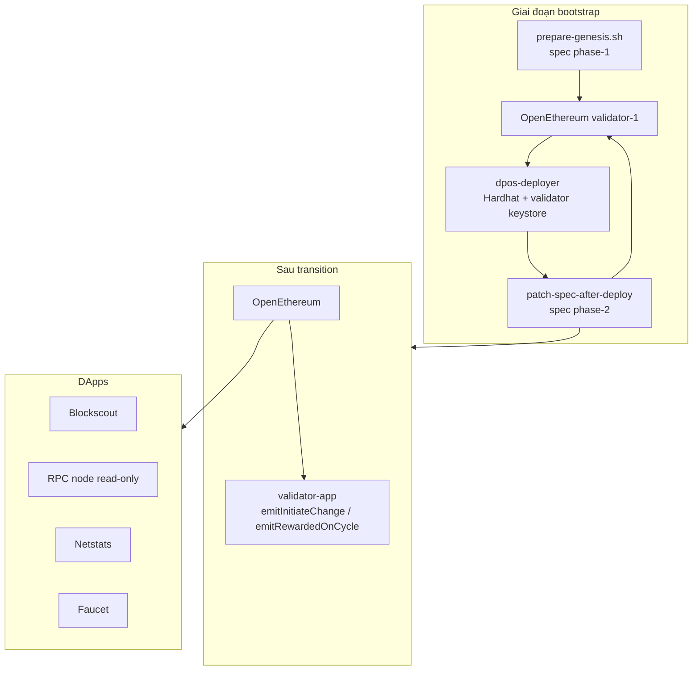

# Chain DPoS Docker Integration

Hướng dẫn tổng quan triển khai blockchain **DPoS** (Delegated Proof of Stake) bằng Docker trong hệ thống DPoS.

> **Trạng thái:** `docker-compose/chain-dpos/` sẵn sàng cho testnet v1 (1 validator, không bootnode).
>
> **Runbook deploy chi tiết:** [dpos-testnet.md](./dpos-testnet.md)

## Docs liên quan

| Tài liệu | Mô tả |
|----------|--------|
| **[dpos-testnet.md](./dpos-testnet.md)** | **Runbook deploy chain mới — Phase A→F** |
| **[remote-deploy.md](./remote-deploy.md)** | **Deploy lên server qua Docker Hub (prepare local, sync bundle)** |
| **[validator-1-custom-contracts.md](./validator-1-custom-contracts.md)** | **Validator-1 với custom contracts GTBS** |
| [custom-staking-gtbs.md](./custom-staking-gtbs.md) | Chi tiết contract GTBS, owner config, staking-keeper |
| [POA](./poa.md) | Triển khai PoA (Geth + bootnode) |
| **[explorer-v11.md](./explorer-v11.md)** | **Explorer DPoS (backend 11.2.1 + frontend 2.8.1)** |
| [Blockscout v4](./explorer-v4.1.8.md) | Explorer monolith (POA legacy) |
| [Netstats](./netstats.md) | Giám sát mạng |
| [Traefik](./traefik.md) | Reverse proxy + SSL (Let's Encrypt tự động) |
| [Eth Faucet](./eth-faucet.md) | Faucet testnet |

## POA vs DPoS

| | POA | DPoS |
|--|-----|------|
| Client | Geth (Clique) | OpenEthereum |
| Discovery | Bootnode riêng | Static `reserved_peers` (validator-1 enode); **không bootnode** |
| Validator v1 | 2 node Geth | **1 node** OpenEthereum (+ validator-app sau transition) |
| Staking / governance | Off-chain | On-chain Consensus + BlockReward contracts |
| Deploy flow | Genesis tĩnh một lần | **Hai pha spec:** phase-1 → deploy on-chain → phase-2 |
| DApps | Blockscout, RPC, faucet, netstats | Dùng chung stack, trỏ RPC OpenEthereum |
| Thư mục Docker | `chain-poa/` | `chain-dpos/` |
| Lưu chain DB | Bind mount `nodes/*/data/` | Bind mount `nodes/*/data/` |

Consensus DPoS tách **staking/governance** (on-chain contracts) và **block production** (OpenEthereum AuthorityRound + validator-app gửi cycle txs).

## Kiến trúc



### Services v1

| Nhóm | Services | Compose file |
|------|----------|--------------|
| Validator 1 | openethereum, netstats-api, validator-app (optional) | `compose-validator-1.yml` |
| Deploy contracts | deployer (one-shot) | `compose-deploy-contracts.yml` |
| DApps + RPC | blockscout v11 (backend + frontend + stats + visualizer), rpc-node, faucet, netstats, traefik | `compose-dapps-traefik-v11.yml` |
| DApps v4 (legacy) | blockscout monolith | `compose-dapps-traefik-v4.yml` |
| Validator 2 | stub (deferred) | `compose-validator-2.yml` |

## Cấu trúc `chain-dpos/`

```
docker-compose/chain-dpos/
├── compose-validator-1.yml
├── compose-deploy-contracts.yml
├── compose-dapps-traefik-v11.yml
├── envs/                         # deploy.env + rendered *.env
├── genesis/                      # Chain artifacts (spec, addresses, enode)
├── nodes/                        # Per-node runtime (config, keys, chain DB)
│   ├── validator-1/
│   │   ├── config.toml
│   │   ├── keystore/
│   │   ├── node.pwd
│   │   └── data/                 # OpenEthereum chain DB (bind mount)
│   └── rpc/
│       ├── config.toml
│       ├── reserved-peers.txt
│       └── data/
├── data/                         # DApps persistent data (Postgres, Traefik TLS)
├── templates/                    # OpenEthereum config templates (committed)
├── scripts/
│   ├── lib/paths.sh              # Unified path constants
│   └── migrate-runtime-layout.sh # One-time migration from old layout
├── traefik/
├── overrides/
└── examples/
```

| Lớp | Host path | Container path (mọi service) |
|-----|-----------|-------------------------------|
| Chain spec | `genesis/spec.json` | `/app/genesis/spec.json` |
| Node config | `nodes/*/config.toml` | `/app/config/config.toml` |
| Keystore | `nodes/validator-1/keystore/` | `/app/keys` (deployer, validator-app) hoặc `/app/data/keys/${NETWORK_NAME}` (OpenEthereum) |
| Password | `nodes/validator-1/node.pwd` | `/app/secrets/node.pwd` |
| Chain DB | `nodes/*/data/` | `/app/data` |
| DApps DB | `data/dpos-*-db/` | Postgres data dir |

Deploy từ thư mục `chain-dpos/` trên server. Chạy `./scripts/migrate-runtime-layout.sh` nếu nâng cấp từ layout cũ (`genesis/validator-1/`, `config/`, `docker-compose/data/`).

## Quy trình triển khai (tóm tắt)

Chi tiết từng bước, biến env, troubleshooting: **[dpos-testnet.md](./dpos-testnet.md)**.

```bash
cd blockchain-dockerize/docker-compose/chain-dpos

# 1. Build images (từ blockchain-docker-base)
# 2. Chuẩn bị envs/dpos.chain.env + envs/dpos.contract.env
# 3. Bootstrap toàn bộ
./scripts/bootstrap-chain.sh

# 4. Tuỳ chọn: validator-app + DApps
export CONSENSUS_PROXY=$(jq -r .consensusProxy genesis/contract-addresses.json)
export BLOCK_REWARD_PROXY=$(jq -r .blockRewardProxy genesis/contract-addresses.json)
docker compose -f compose-validator-1.yml --profile consensus up -d validator-app

./scripts/prepare-envs-dapps.sh
docker compose -f compose-dapps-traefik-v4.yml up -d
```

### Hai pha spec (quan trọng)

1. **Phase-1** (`prepare-genesis.sh`): Validator list tĩnh trong spec, premine treasury + balance gas cho validator. Chưa có địa chỉ Consensus/BlockReward.
2. **Deploy on-chain** (`compose-deploy-contracts.yml`): Hardhat deploy qua RPC; **ký bằng keystore validator-1** (không dùng treasury private key).
3. **Phase-2** (`patch-spec-after-deploy.sh`): Gắn `safeContract` + `blockRewardContractAddress` tại `CONTRACT_TRANSITION_BLOCK`, restart node.
4. **Verify** (`verify-contracts-transition.sh`): Sau block transition, consensus contract điều khiển validator set.

Deploy + patch + restart **phải xong trước** `CONTRACT_TRANSITION_BLOCK`.

## Images cần build

Từ `blockchain-docker-base` (xem [`README.md`](../../blockchain-docker-base/README.md)):

```bash
./scripts/build-and-push.sh --chain      # openethereum, validator-app, dpos-deployer, netstats-api
./scripts/build-and-push.sh --explorer   # blockscout-backend:11.2.1, blockscout-frontend:2.8.1 (+ legacy)
./scripts/build-and-push.sh --dapps      # netstats-dashboard, eth-faucet (testnet), docs-poa
```

## Config OpenEthereum

| Node | Template | Render output |
|------|----------|---------------|
| Validator-1 | `templates/validator-1.toml.template` | `nodes/validator-1/config.toml` |
| RPC (archive) | `templates/rpc.toml.template` | `nodes/rpc/config.toml` |

### Validator-1

```toml
[rpc]
hosts = ["all"]         # trong container — cho Docker forward từ host
interface = "all"
port = 8545

[websockets]
disable = true
```

Compose map **`127.0.0.1:8545:8545`** trên host (`overrides/validator-1.override.yml`) — lớp bảo vệ thực sự; **không** đổi thành `0.0.0.0:8545:8545` trừ khi cố ý public RPC.

```toml
[mining]
force_sealing = true
engine_signer = "<VALIDATOR_ADDRESS>"
reseal_on_txs = "none"

[account]
unlock = ["<VALIDATOR_ADDRESS>"]
password = ["/app/secrets/node.pwd"]
```

### RPC node

```toml
[network]
reserved_peers = "/app/config/reserved-peers.txt"

[websockets]
disable = false
interface = "all"
port = 8546
```

`prepare-rpc-node.sh` copy `genesis/validator-1.enode` → `nodes/rpc/reserved-peers.txt`.

### Mount volumes (validator-1)

| Host | Container | Mục đích |
|------|-----------|----------|
| `genesis/spec.json` | `/app/genesis/spec.json` | Chain spec |
| `nodes/validator-1/keystore/` | `/app/data/keys/${NETWORK_NAME}` | Keystore OpenEthereum |
| `nodes/validator-1/node.pwd` | `/app/secrets/node.pwd` | Password unlock |
| `nodes/validator-1/config.toml` | `/app/config/config.toml` | Client config |
| `nodes/validator-1/data/` | `/app/data` | Chain database |

### validator-app

```
nodes/validator-1/keystore  →  /app/keys          (KEYSTORE_DIR)
nodes/validator-1/node.pwd  →  /app/secrets/node.pwd  (PASSWORD_FILE)
```

Cần export proxy addresses trước khi start:

```bash
export CONSENSUS_PROXY=$(jq -r .consensusProxy genesis/contract-addresses.json)
export BLOCK_REWARD_PROXY=$(jq -r .blockRewardProxy genesis/contract-addresses.json)
```

## DApps dùng chung với POA

Các service chỉ cần JSON-RPC — không phụ thuộc consensus:

| Service | Image | RPC |
|---------|-------|-----|
| Blockscout | `blockscout-base:4.1.8` | `ETHEREUM_JSONRPC_VARIANT=openethereum` |
| Netstats | `netstats-dashboard`, `netstats-api` | Mỗi validator chạy netstats-api |
| Faucet | `eth-faucet:0.0.1` | Testnet |
| Proxy | Traefik | Domain RPC, explorer, status — routing qua Docker labels |

`compose-dapps-traefik-v4.yml` chạy thêm OpenEthereum RPC node (read-only, không keystore) sync từ cùng `genesis/spec.json`. SSL qua Let's Encrypt (ACME), không cần nginx/certbot. Chi tiết: [traefik.md](./traefik.md).

Reuse từ `chain-poa`: `docker-compose/services/*`, pattern overrides trong `overrides/`.

## Validator-2 và mở rộng

- **Không bootnode:** peering qua `nodes/rpc/reserved-peers.txt` (nguồn từ `genesis/validator-1.enode`).
- Validator-2 chạy trên server khác: outline `scripts/setup-validator-2-remote.sh` (chưa implement v1).
- Validator mới cần stake `MIN_STAKE_TOKENS` qua Consensus contract.

## Troubleshooting

| Vấn đề | Hướng xử lý |
|--------|-------------|
| Validator không seal block | `engine_signer`, unlock account, `force_sealing`, keystore mount đúng `${NETWORK_NAME}` |
| Deploy lỗi "Deployer must be validator-1" | Deployer phải ký bằng keystore validator-1 |
| Deploy lỗi gas / out of funds | Chỉ xảy ra khi `ENABLE_EIP1559=true`; tăng `VALIDATOR_BALANCE_WEI` hoặc tắt EIP-1559 (deploy zero-gas) |
| Deploy quá muộn (sau transition block) | Tạo chain mới; tăng `CONTRACT_TRANSITION_BLOCK` |
| RPC unreachable từ deployer | Deployer dùng `http://openethereum:8545` trên network `dpos-validator-1_default` (không qua host bind `127.0.0.1:8545`) |
| Blockscout không sync | `CHAIN_ID`, RPC URL, variant `openethereum` |
| validator-app skip | Chờ transition; kiểm tra `CONSENSUS_PROXY` / `BLOCK_REWARD_PROXY` |

Chi tiết: [dpos-testnet.md §14](./dpos-testnet.md#14-troubleshooting).

## Liên quan

- [dpos-testnet.md](./dpos-testnet.md) — Runbook deploy đầy đủ
- [POA](./poa.md)
- [Design](../design.md)
- [blockchain-docker-base](https://gitlab.vn/quyenduy/blockchain-docker-base) — build images
