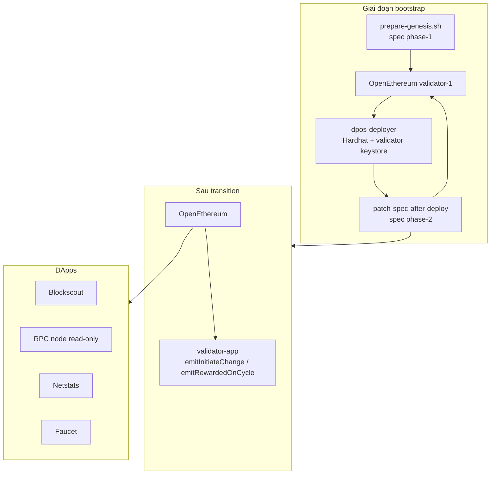

# Chain DPoS Docker Integration

Hướng dẫn tổng quan triển khai blockchain **DPoS** (Delegated Proof of Stake) bằng Docker trong hệ thống ICSC.

> **Trạng thái:** `docker-compose/chain-dpos/` sẵn sàng cho testnet v1 (1 validator, không bootnode).
>
> **Runbook deploy chi tiết:** [dpos-testnet.md](./dpos-testnet.md)

## Docs liên quan

| Tài liệu | Mô tả |
|----------|--------|
| **[dpos-testnet.md](./dpos-testnet.md)** | **Runbook deploy chain mới — Phase A→F** |
| [POA](./poa.md) | Triển khai PoA (Geth + bootnode) |
| **[explorer-v11.md](./explorer-v11.md)** | **Explorer DPoS (backend 11.2.1 + frontend 2.8.1)** |
| [Blockscout v4](./explorer-v4.1.8.md) | Explorer monolith (POA legacy) |
| [Netstats](./netstats.md) | Giám sát mạng |
| [Traefik](./traefik.md) | Reverse proxy + SSL (Let's Encrypt tự động) |
| [Eth Faucet](./eth-faucet.md) | Faucet testnet |

## POA vs DPoS

| | POA | DPoS |
|--|-----|------|
| Client | Geth (Clique) | OpenEthereum |
| Discovery | Bootnode riêng | Static `reserved_peers` (validator-1 enode); **không bootnode** |
| Validator v1 | 2 node Geth | **1 node** OpenEthereum (+ validator-app sau transition) |
| Staking / governance | Off-chain | On-chain Consensus + BlockReward contracts |
| Deploy flow | Genesis tĩnh một lần | **Hai pha spec:** phase-1 → deploy on-chain → phase-2 |
| DApps | Blockscout, RPC, faucet, netstats | Dùng chung stack, trỏ RPC OpenEthereum |
| Thư mục Docker | `chain-poa/` | `chain-dpos/` |
| Lưu chain DB | Bind mount `data/${NETWORK_TYPE}/…` | Docker named volumes (`openethereum_db`, …) |

Consensus DPoS tách **staking/governance** (on-chain contracts) và **block production** (OpenEthereum AuthorityRound + validator-app gửi cycle txs).

## Kiến trúc



### Services v1

| Nhóm | Services | Compose file |
|------|----------|--------------|
| Validator 1 | openethereum, netstats-api, validator-app (optional) | `compose-validator-1.yml` |
| Deploy contracts | deployer (one-shot) | `compose-deploy-contracts.yml` |
| DApps + RPC | blockscout v11 (backend + frontend + stats + visualizer), rpc-node, faucet, netstats, traefik | `compose-dapps-traefik-v11.yml` |
| DApps v4 (legacy) | blockscout monolith | `compose-dapps-traefik-v4.yml` |
| Validator 2 | stub (deferred) | `compose-validator-2.yml` |

## Cấu trúc `chain-dpos/`

```
docker-compose/chain-dpos/
├── compose-validator-1.yml       # Validator + netstats-api + validator-app
├── compose-deploy-contracts.yml  # One-shot Hardhat deploy
├── compose-dapps-traefik-v11.yml  # Explorer v11, RPC archive node, Traefik
├── compose-dapps-traefik-v4.yml   # Legacy v4 monolith (reference)
├── compose-validator-2.yml       # Stub — validator remote (v2)
├── envs/
│   ├── dpos.chain.env.example    # NETWORK_ID, premine, validator balance, transition
│   ├── dpos.contract.env.example # Stake, inflation, cycle
│   ├── traefik.env.example       # Domain + ACME email
│   └── *.env.example             # DApps, blockscout, netstats, …
├── genesis/                      # Sinh bởi prepare-genesis.sh (gitignored)
├── config/
│   └── validator-1.toml.template
├── scripts/
│   ├── bootstrap-chain.sh        # Phase A–F tự động
│   ├── prepare-genesis.sh        # Phase A
│   ├── patch-spec-after-deploy.sh
│   ├── restart-validator-1.sh
│   ├── verify-contracts-transition.sh
│   ├── get_enode.sh
│   ├── prepare-envs-dapps.sh
│   ├── prepare-envs-validator-1.sh
│   ├── gen-validator-account.sh
│   └── traefik/prepare-envs-traefik.sh
├── traefik/                      # Static config + middlewares
├── overrides/                    # Mount genesis, keystore, Traefik labels
└── examples/
    └── config-dpos.toml          # Tham khảo local (không dùng trực tiếp trong compose)
```

## Quy trình triển khai (tóm tắt)

Chi tiết từng bước, biến env, troubleshooting: **[dpos-testnet.md](./dpos-testnet.md)**.

```bash
cd blockchain-dockerize/docker-compose/chain-dpos

# 1. Build images (từ blockchain-docker-base)
# 2. Chuẩn bị envs/dpos.chain.env + envs/dpos.contract.env
# 3. Bootstrap toàn bộ
./scripts/bootstrap-chain.sh

# 4. Tuỳ chọn: validator-app + DApps
export CONSENSUS_PROXY=$(jq -r .consensusProxy genesis/contract-addresses.json)
export BLOCK_REWARD_PROXY=$(jq -r .blockRewardProxy genesis/contract-addresses.json)
docker compose -f compose-validator-1.yml --profile consensus up -d validator-app

./scripts/prepare-envs-dapps.sh
docker compose -f compose-dapps-traefik-v4.yml up -d
```

### Hai pha spec (quan trọng)

1. **Phase-1** (`prepare-genesis.sh`): Validator list tĩnh trong spec, premine treasury + balance gas cho validator. Chưa có địa chỉ Consensus/BlockReward.
2. **Deploy on-chain** (`compose-deploy-contracts.yml`): Hardhat deploy qua RPC; **ký bằng keystore validator-1** (không dùng treasury private key).
3. **Phase-2** (`patch-spec-after-deploy.sh`): Gắn `safeContract` + `blockRewardContractAddress` tại `CONTRACT_TRANSITION_BLOCK`, restart node.
4. **Verify** (`verify-contracts-transition.sh`): Sau block transition, consensus contract điều khiển validator set.

Deploy + patch + restart **phải xong trước** `CONTRACT_TRANSITION_BLOCK`.

## Images cần build

Từ `blockchain-docker-base`:

```bash
docker build . -t openethereum:0.0.1 -f docker/Dockerfile.openethereum
docker build . -t validator-app:0.0.1 -f docker/Dockerfile.validator-app
docker build . -t dpos-deployer:0.0.1 -f docker/Dockerfile.dpos-deployer
docker build . -t netstats-api:0.0.1 -f docker/Dockerfile.netstats-api
docker build . -t blockscout-base:4.1.8 -f docker/Dockerfile.blockscout-base-4.1.8
docker build . -t netstats-dashboard:0.0.1 -f docker/Dockerfile.netstats-dashboard
docker build . -t eth-faucet:0.0.1 -f docker/Dockerfile.eth-faucet
```

## Config OpenEthereum

Template: `config/validator-1.toml.template` — render bởi `prepare-envs-validator-1.sh` sau Phase A.

Điểm quan trọng:

```toml
[rpc]
interface = "all"    # Bắt buộc cho Docker network

[mining]
force_sealing = true
engine_signer = "<VALIDATOR_ADDRESS>"
reseal_on_txs = "none"

[account]
unlock = ["<VALIDATOR_ADDRESS>"]
password = ["/app/genesis/validator-1/node.pwd"]
```

### Mount volumes (validator-1)

| Host | Container | Mục đích |
|------|-----------|----------|
| `genesis/spec.json` | `/app/genesis/spec.json` | Chain spec |
| `genesis/validator-1/keystore/` | `/app/data/keys/${NETWORK_NAME}` | Keystore OpenEthereum |
| `genesis/validator-1/node.pwd` | `/app/genesis/validator-1/node.pwd` | Password unlock |
| `config/validator-1.toml` | `/app/config/validator-1.toml` | Client config |

Chain database lưu trong Docker volume `openethereum_db` (không bind mount ra host như POA).

### validator-app

Keystore mount: `genesis/validator-1/keystore` → `/app/config/keys/${NETWORK_NAME}`.

Cần export proxy addresses trước khi start:

```bash
export CONSENSUS_PROXY=$(jq -r .consensusProxy genesis/contract-addresses.json)
export BLOCK_REWARD_PROXY=$(jq -r .blockRewardProxy genesis/contract-addresses.json)
```

## DApps dùng chung với POA

Các service chỉ cần JSON-RPC — không phụ thuộc consensus:

| Service | Image | RPC |
|---------|-------|-----|
| Blockscout | `blockscout-base:4.1.8` | `ETHEREUM_JSONRPC_VARIANT=openethereum` |
| Netstats | `netstats-dashboard`, `netstats-api` | Mỗi validator chạy netstats-api |
| Faucet | `eth-faucet:0.0.1` | Testnet |
| Proxy | Traefik | Domain RPC, explorer, status — routing qua Docker labels |

`compose-dapps-traefik-v4.yml` chạy thêm OpenEthereum RPC node (read-only, không keystore) sync từ cùng `genesis/spec.json`. SSL qua Let's Encrypt (ACME), không cần nginx/certbot. Chi tiết: [traefik.md](./traefik.md).

Reuse từ `chain-poa`: `docker-compose/services/*`, pattern overrides trong `overrides/`.

## Validator-2 và mở rộng

- **Không bootnode:** peering qua `reserved_peers` + enode validator-1 (`genesis/validator-1.enode`).
- Validator-2 chạy trên server khác: outline `scripts/setup-validator-2-remote.sh` (chưa implement v1).
- Validator mới cần stake `MIN_STAKE_TOKENS` qua Consensus contract.

## Troubleshooting

| Vấn đề | Hướng xử lý |
|--------|-------------|
| Validator không seal block | `engine_signer`, unlock account, `force_sealing`, keystore mount đúng `${NETWORK_NAME}` |
| Deploy lỗi "Deployer must be validator-1" | Deployer phải ký bằng keystore validator-1; kiểm tra `VALIDATOR_BALANCE_WEI` đủ gas |
| Deploy quá muộn (sau transition block) | Tạo chain mới; tăng `CONTRACT_TRANSITION_BLOCK` |
| RPC unreachable từ deployer | `interface = "all"` trong validator-1.toml |
| Blockscout không sync | `CHAIN_ID`, RPC URL, variant `openethereum` |
| validator-app skip | Chờ transition; kiểm tra `CONSENSUS_PROXY` / `BLOCK_REWARD_PROXY` |

Chi tiết: [dpos-testnet.md §14](./dpos-testnet.md#14-troubleshooting).

## Liên quan

- [dpos-testnet.md](./dpos-testnet.md) — Runbook deploy đầy đủ
- [POA](./poa.md)
- [Design](../design.md)
- [blockchain-docker-base](https://gitlab.icsc.vn/quyenduy/blockchain-docker-base) — build images
