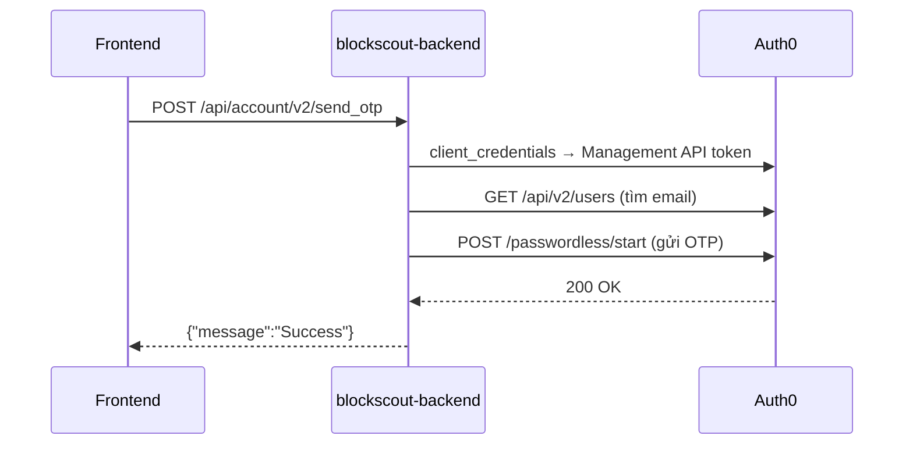

# Blockscout Explorer — Auth0 login (email OTP)

Hướng dẫn cấu hình **Auth0** để tính năng **My Account / Continue with email** hoạt động trên Blockscout v11 (backend 11.2.1 + frontend 2.8.1).

Áp dụng cho stack DPoS: `docker-compose/chain-dpos` với Traefik v11.

## Tổng quan

Khi user bấm **Send a code**, backend Blockscout gọi Auth0 theo thứ tự:



**Một** Auth0 Application (`CLIENT_ID` / `CLIENT_SECRET` trong env) phải làm được **cả hai**:

| Luồng | Auth0 API | Yêu cầu |
|-------|-----------|---------|
| Tìm / quản lý user | Management API | Grant **Client Credentials** + **Client Access** scopes |
| Gửi OTP email | Passwordless Email | Connection **email** bật cho app |

> **Không dùng** application kiểu **Machine to Machine** làm app duy nhất cho explorer login. M2M không hỗ trợ passwordless email. Dùng **Regular Web Application**.

OTP email do **Auth0 Passwordless** gửi, **không** qua SendGrid. SendGrid (`ACCOUNT_SENDGRID_*`) chỉ dùng cho watchlist notification.

---

## 1. Tạo Auth0 Application

1. [Auth0 Dashboard](https://manage.auth0.com/) → **Applications** → **Create Application**
2. Tên ví dụ: `GTBS Explorer`
3. Loại: **Regular Web Application**
4. Lưu **Domain**, **Client ID**, **Client Secret**

---

## 2. Credentials — Authentication Method

**Applications → &lt;app&gt; → Credentials**

| Field | Giá trị |
|-------|---------|
| **Authentication Method** | **Client Secret (Post)** |

Không để **None**. Nếu để `None`, grant **Client Credentials** sẽ bị grey và backend trả lỗi `Misconfiguration detected`.

> UI Auth0 mới: setting này nằm ở tab **Credentials**, không còn trong Settings → Advanced → OAuth.

---

## 3. Grant Types

**Applications → &lt;app&gt; → Settings → Advanced Settings → Grant Types**

Bật:

- [x] **Authorization Code** (mặc định)
- [x] **Refresh Token** (khuyến nghị)
- [x] **Client Credentials** ← bắt buộc
- [x] **Passwordless OTP** ← bắt buộc (xác nhận OTP)

**Save Changes**.

---

## 4. Management API — Client Access

**Applications → &lt;app&gt; → API Access → Auth0 Management API**

Tab **Client Access** (không phải User-Delegated Access):

1. Nếu **Access Policy** chưa per-app: **APIs → Auth0 Management API → Settings** → **Per-Application** → Save
2. Chọn scopes:
   - `read:users`
   - `create:users`
   - `update:users`
   - `delete:users`
3. Bấm **Grant Access**

Cột **Client Access** phải hiển thị **4 / 265** (hoặc tương tự), không phải **0 / 265**.

---

## 5. Passwordless Email

**Authentication → Passwordless → Email → Configure**

### Tab Settings

| Field | Gợi ý |
|-------|--------|
| Connection | `email` (giữ mặc định) |
| From / Subject | Dev/trial: giữ mặc định Auth0 |
| Email Provider | **Auth0** (trial) hoặc custom SMTP/SendGrid (production) |

**Save**.

### Tab Applications

Bật toggle cho app **Regular Web** (ví dụ `GTBS Explorer`). Không bật app M2M.

### Tab Try (optional)

Gửi OTP thử tới email test — xác nhận Auth0 gửi mail được.

---

## 6. Application URIs

**Applications → &lt;app&gt; → Settings**

Thay `gtbsblockchain.com` bằng domain explorer thực tế:

```
Allowed Callback URLs:  https://gtbsblockchain.com/auth/auth0/callback
Allowed Logout URLs:    https://gtbsblockchain.com/auth/logout
Allowed Web Origins:    https://gtbsblockchain.com
```

**Save Changes**.

---

## 7. Biến môi trường Blockscout

### Backend — `envs/blockscout-backend.env`

```env
ACCOUNT_ENABLED=true
ACCOUNT_CLOAK_KEY=<base64-32-bytes>          # openssl rand -base64 32
ACCOUNT_AUTH0_DOMAIN=your-tenant.us.auth0.com
ACCOUNT_AUTH0_CLIENT_ID=<Regular Web app Client ID>
ACCOUNT_AUTH0_CLIENT_SECRET=<Client Secret>
RE_CAPTCHA_SECRET_KEY=<Google reCAPTCHA secret>
ACCOUNT_REDIS_URL=redis://redis-db:6379
BLOCKSCOUT_HOST=gtbsblockchain.com
BLOCKSCOUT_PROTOCOL=https
```

`ACCOUNT_CLOAK_KEY` dùng mã hóa token cache trên Redis — **không đổi** sau khi production đã chạy (hoặc xóa cache Redis `*auth0*`).

Các biến tương ứng trong `deploy.env` → render bằng `./scripts/render-envs.sh`.

### Frontend — `envs/blockscout-frontend.env`

```env
NEXT_PUBLIC_IS_ACCOUNT_SUPPORTED=true
NEXT_PUBLIC_RE_CAPTCHA_APP_SITE_KEY=<Google reCAPTCHA site key>
```

reCAPTCHA site key (frontend) và secret key (backend) phải cùng một cặp Google reCAPTCHA.

---

## 8. Triển khai trên server

Sau khi sửa env:

```bash
cd docker-compose/chain-dpos

# Render env từ deploy.env (nếu dùng workflow chuẩn)
./scripts/render-envs.sh

# Restart backend (và frontend nếu đổi reCAPTCHA site key)
docker compose -f compose-dapps-traefik-v11.yml restart backend frontend

# Xóa cache M2M JWT cũ trên Redis (sau đổi Auth0 hoặc ACCOUNT_CLOAK_KEY)
docker exec redis-db redis-cli KEYS "*auth0*"
docker exec redis-db redis-cli DEL <key>   # lặp cho từng key
```

Kiểm tra env trong container:

```bash
docker exec blockscout-backend printenv | grep ACCOUNT_AUTH0
```

---

## 9. Kiểm tra (verification)

### 9.1 Auth0 — client_credentials

```bash
curl -s -X POST 'https://YOUR_TENANT.us.auth0.com/oauth/token' \
  -H 'Content-Type: application/json' \
  -d '{
    "client_id": "YOUR_CLIENT_ID",
    "client_secret": "YOUR_CLIENT_SECRET",
    "audience": "https://YOUR_TENANT.us.auth0.com/api/v2/",
    "grant_type": "client_credentials"
  }'
```

Kỳ vọng: JSON có `"access_token": "eyJ..."`.

Lỗi thường gặp:

| Response | Nguyên nhân |
|----------|-------------|
| `Grant type 'client_credentials' not allowed` | Chưa bật Grant Type **Client Credentials** hoặc Authentication Method vẫn là **None** |
| `access_denied` | Chưa **Client Access** Management API |
| `invalid_client` | CLIENT_ID / SECRET sai hoặc env server chưa cập nhật |

### 9.2 Auth0 — passwordless

```bash
curl -s -X POST 'https://YOUR_TENANT.us.auth0.com/passwordless/start' \
  -H 'Content-Type: application/json' \
  -d '{
    "client_id": "YOUR_CLIENT_ID",
    "client_secret": "YOUR_CLIENT_SECRET",
    "connection": "email",
    "email": "test@example.com",
    "send": "code"
  }'
```

Kỳ vọng: `"email": "test@example.com"`.

### 9.3 Explorer UI

1. Mở explorer → **Sign in** → **Continue with email**
2. Nhập email → **Send a code**
3. Network: `POST /api/account/v2/send_otp` → **200** `{"message":"Success"}`
4. Nhập OTP → đăng nhập thành công

**Rate limit:** `send_otp` giới hạn **1 request / giờ / IP** (có thể bypass bằng reCAPTCHA). Lỗi **429** không phải lỗi cấu hình Auth0.

---

## 10. Troubleshooting

| Triệu chứng UI | Nguyên nhân | Cách xử lý |
|----------------|-------------|------------|
| `Misconfiguration detected, please contact support.` | Không lấy được Management API token | Bật **Client Credentials**, **Client Secret (Post)**, **Client Access** 4 scopes |
| `Unexpected error` | `/passwordless/start` fail | Bật Passwordless Email + app trong tab Applications |
| `Grant type 'client_credentials' not allowed` | Token Endpoint Auth = None | **Credentials → Client Secret (Post)** |
| Client Credentials grey trong Grant Types | Authentication Method = None | Đổi ở tab **Credentials** |
| Client Access toggle grey / 0 permissions | Chưa cấu hình Email Settings | Passwordless Email → Settings → **Save** trước |
| Vẫn lỗi sau khi sửa Auth0 | Cache Redis token cũ | `KEYS *auth0*` → `DEL` + restart backend |
| 429 Too many requests | Rate limit Blockscout | Đợi 1h hoặc test IP khác |

Log backend:

```bash
docker logs blockscout-backend 2>&1 | grep -iE 'auth0|M2M|otp|insufficient|passwordless'
```

---

## Checklist nhanh

- [ ] Application type: **Regular Web Application**
- [ ] **Credentials** → Authentication Method: **Client Secret (Post)**
- [ ] Grant Types: **Client Credentials** + **Passwordless OTP**
- [ ] API Access → **Client Access**: 4 user scopes
- [ ] Passwordless Email → app **ON**
- [ ] Callback / Logout / Web Origins đúng domain
- [ ] `blockscout-backend.env` + `blockscout-frontend.env` đã set
- [ ] Restart backend (+ frontend nếu cần)
- [ ] Xóa Redis `*auth0*` (sau thay đổi Auth0/CLOAK_KEY)
- [ ] `curl client_credentials` → `access_token`
- [ ] Explorer **Send a code** → 200

---

## Tài liệu liên quan

- [explorer-v11.md](./explorer-v11.md) — stack Blockscout v11
- [Blockscout My Account settings](https://docs.blockscout.com/setup/configuration-options/my-account-settings)
- Env mẫu: `docker-compose/chain-dpos/envs/blockscout-backend.env.example`
