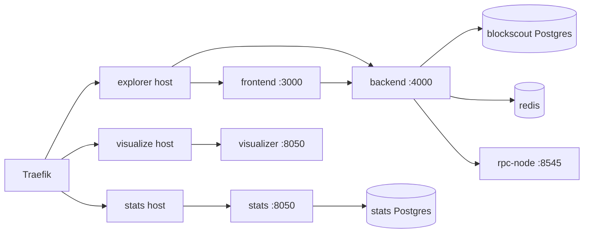

# Blockscout v11 (DPoS Explorer)

DPoS chains use **Blockscout backend 11.2.1** + **frontend 2.8.1** with optional **stats** and **visualizer** microservices behind Traefik.

For optional GTBS branding and DPoS widgets, see [explorer-custom-theme.md](./explorer-custom-theme.md).

> **Note:** POA reference stacks may still use Blockscout v4 monolith. See [explorer-v4.1.8.md](./explorer-v4.1.8.md).

## Architecture



| Hostname (traefik.env) | Service | Port |
|------------------------|---------|------|
| `EXPLORER_SERVER_NAME` | frontend + backend API | 3000 / 4000 |
| `STATS_SERVER_NAME` | stats | 8050 |
| `VISUALIZE_SERVER_NAME` | visualizer | 8050 |

Routing is generated from `traefik/dynamic/blockscout-v11.yml.template` via `./scripts/traefik/generate-blockscout-v11.sh`.

## Build images

Images are built in CI and published to Docker Hub. See [`blockchain-docker-base/README.md`](../../blockchain-docker-base/README.md).

Set `DOCKERHUB_NAMESPACE` in `deploy.env` (or override individual `*_IMAGE` vars). After `./scripts/render-envs.sh`, `images.env` contains full refs such as:

```
youruser/blockchain-dock-blockscout-backend:11.2.1
youruser/blockchain-dock-blockscout-frontend:2.8.1
```

Local build (without Docker Hub):

```bash
cd ../../../blockchain-docker-base
./scripts/build-and-push.sh --explorer
```

Stats and visualizer use upstream images by default (`ghcr.io/blockscout/stats`, `ghcr.io/blockscout/visualizer`). Override tags in `deploy.env` → `images.env`.

## OpenEthereum / Clique RPC settings

The archive **rpc-node** (not validator-1) serves JSON-RPC to Blockscout:

| Env var | Value |
|---------|-------|
| `ETHEREUM_JSONRPC_VARIANT` | `nethermind` (OpenEthereum compatibility mode for Blockscout v11) |
| `BLOCK_TRANSFORMER` | `base` (AuthorityRound — **not** `clique`) |
| `ETHEREUM_JSONRPC_HTTP_URL` | `http://rpc.host:8545/` |
| `ETHEREUM_JSONRPC_WS_URL` | `ws://rpc.host:8546/` |

## Custom address prefix (bech32 UI)

Explorer can show addresses with a custom human-readable prefix while the chain stores standard `0x` addresses.

| `deploy.env` | Rendered frontend env |
|--------------|----------------------|
| `ADDRESS_DISPLAY_PREFIX=custom1` | `NEXT_PUBLIC_VIEWS_ADDRESS_BECH_32_PREFIX=custom1` |
| `ADDRESS_DISPLAY_DEFAULT=bech32` | `NEXT_PUBLIC_VIEWS_ADDRESS_FORMAT=['bech32','base16']` (bech32 first) |
| `ADDRESS_FORMAT_TOGGLE=true` | Settings toggle + alternate format on address page |
| *(empty prefix)* | Vars omitted — standard `0x` display |

**Format:** BIP-173 bech32 — e.g. `custom1qxy2kgdyjrs5qv…`, not `custom1` + the same 40 hex digits as `0x`.

**End users:**
- Wallets (MetaMask, etc.) and RPC tools require the **`0x`** address.
- Toggle format: explorer **Settings** → “Show custom1 format”.
- On an address page, the alternate format row shows the other encoding.

**Operator:** Set vars in `deploy.env`, run `./scripts/render-envs.sh`, restart frontend:

```bash
docker compose -f compose-dapps-traefik-v11.yml restart frontend
```

No frontend image rebuild needed for env-only prefix changes — env is applied at container start via `env_file` and `make_envs_script.sh`. Rebuild the frontend image when applying the `SettingsContext` default-format patch (see `blockscout-frontend-2.8.1`).

## Compose stack

```bash
cd docker-compose/chain-dpos
cp envs/deploy.env.example envs/deploy.env
# edit domains + chain identity
./scripts/deploy-all.sh --with-traefik
```

Or DApps only (chain already bootstrapped):

```bash
./scripts/prepare-rpc-node.sh
./scripts/prepare-envs-dapps.sh
docker compose -f compose-dapps-traefik-v11.yml --profile faucet up -d   # testnet
```

## Data volumes

| Path | Purpose |
|------|---------|
| `data/dpos-blockscout-db/` | Blockscout Postgres |
| `data/dpos-stats-db/` | Stats Postgres |
| `nodes/rpc/data/` | Archive RPC node chain data |
| `nodes/validator-1/data/` | Validator chain data |

## Migration from v4 monolith

1. Stop `compose-dapps-traefik-v4.yml`.
2. Back up `data/dpos-blockscout-db/` if reusing chain data (schema may differ — fresh DB recommended for new chains).
3. Render env from `deploy.env` and start `compose-dapps-traefik-v11.yml`.
4. Update DNS to point explorer/stats/visualize hostnames to Traefik.

DPoS new deployments should use v11 only; v4 compose remains for POA reference.
