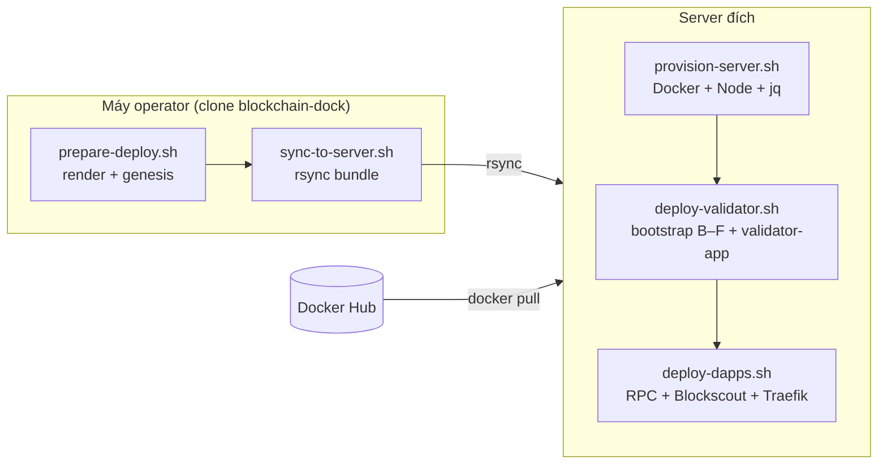

# Remote deploy (Docker Hub + local prepare)

Triển khai chain DPoS lên server **không clone git trên server**. Operator chuẩn bị trên máy local; server chỉ cài môi trường, `docker pull`, và `docker compose up`.

> **Makefile:** Các bước dưới có thể chạy qua `make` từ root `blockchain-dock/`. Xem [docs/makefile.md](../../docs/makefile.md).

## Luồng tổng quan



| Vai trò | Việc làm |
|---------|----------|
| **Local** | Clone repo, sửa `deploy.env`, genesis (phase A), rsync bundle |
| **Docker Hub** | Images `DOCKERHUB_NAMESPACE/blockchain-dock-*` (CI hoặc `build-and-push.sh --push`) |
| **Server** | Cài Docker một lần; chạy deploy validator / dapps theo nhu cầu |

---

## Bước 1 — Build & push images (một lần / mỗi release)

Trên máy có Docker (hoặc CI):

```bash
cd blockchain-docker-base
docker login
./scripts/build-and-push.sh --push --namespace <dockerhub-user>
```

Hoặc từ root monorepo:

```bash
make build login
make build push DOCKERHUB_NAMESPACE=<dockerhub-user>
```

Chi tiết: [`blockchain-docker-base/README.md`](../../blockchain-docker-base/README.md).

---

## Bước 2 — Chuẩn bị trên máy operator

```bash
cd blockchain-dockerize/docker-compose/chain-dpos

cp envs/deploy.env.example envs/deploy.env
# Sửa: DOCKERHUB_NAMESPACE, NETWORK_*, PREMINE_ADDRESS, domains (--with-traefik)

./scripts/local/prepare-deploy.sh --with-traefik
```

Makefile:

```bash
make dpos init
# chỉnh envs/deploy.env
make dpos prepare-remote WITH_TRAEFIK=1
```

Script này chạy `render-envs.sh` + `prepare-genesis.sh` (phase A: keystore, spec phase-1).

---

## Bước 2b — SSH key (một lần, khuyến nghị)

Các lệnh `provision-remote`, `sync`, `ssh-deploy-*` dùng **SSH key** — không hỏi password lặp lại.

```bash
# Tạo key nếu chưa có
ssh-keygen -t ed25519 -C "$(whoami)@$(hostname)"

# Copy key lên server (nhập password server một lần duy nhất)
make dpos setup-ssh SERVER=ubuntu@your-server
```

Hoặc: `ssh-copy-id ubuntu@your-server`

Kiểm tra:

```bash
ssh -o BatchMode=yes ubuntu@your-server "echo ok"
```

> Dùng user deploy thường (`ubuntu@`), không khuyến nghị `root@` cho vận hành hàng ngày.

---

## Bước 3 — Provision server (một lần)

**Từ máy operator:**

```bash
./scripts/local/provision-remote.sh ubuntu@your-server
```

Makefile: `make dpos provision-remote SERVER=ubuntu@your-server`

**Hoặc trên server:**

```bash
sudo ./scripts/remote/provision-server.sh
```

Cài: Docker 20.10+, Compose v2, Node 18+, `jq`, `curl`, `rsync`.

Cấu hình log Docker (`/etc/docker/daemon.json`): **tối đa 3 file × 10MB** mỗi container (`json-file` driver). Tuỳ chỉnh khi provision:

```bash
sudo DOCKER_LOG_MAX_SIZE=10m DOCKER_LOG_MAX_FILE=3 ./scripts/remote/provision-server.sh
```

Container đã chạy trước khi đổi daemon cần recreate để áp dụng log mới: `docker compose up -d --force-recreate`.

---

## Bước 4 — Sync bundle lên server

```bash
./scripts/local/sync-to-server.sh ubuntu@your-server
# Tuỳ chọn custom path:
# ./scripts/local/sync-to-server.sh ubuntu@your-server /opt/blockchain-dock
```

Makefile:

```bash
make dpos sync SERVER=ubuntu@your-server
make dpos sync SERVER=ubuntu@your-server REMOTE_DIR=/opt/blockchain-dock
```

Đồng bộ:

- `blockchain-dockerize/docker-compose/chain-dpos/` (genesis, keystore, env, compose, scripts)
- `blockchain-dockerize/docker-compose/services/` (shared compose fragments cho validator/DApps)
- `blockchain-dockerize/docker-compose/envs/` (paths `../envs/*.env` trong services compose)
- `blockchain-docker-base/resources/dpos-contracts/` (script bootstrap trên server)

**Không** sync `nodes/*/data/`, `data/` (DB tạo mới trên server).

---

## Bước 5 — Deploy trên server

SSH vào server:

```bash
cd /opt/blockchain-dock/blockchain-dockerize/docker-compose/chain-dpos

# Validator: bootstrap chain (B–F) + validator-app
./scripts/remote/deploy-validator.sh --with-traefik

# DApps: RPC + Blockscout v11 + Traefik (+ faucet nếu testnet)
./scripts/remote/deploy-dapps.sh
```

Makefile (từ operator, qua SSH):

```bash
make dpos ssh-deploy-validator SERVER=ubuntu@your-server WITH_TRAEFIK=1
make dpos ssh-deploy-dapps SERVER=ubuntu@your-server
```

Hoặc trên server sau khi SSH:

```bash
make deploy-remote-validator WITH_TRAEFIK=1
make deploy-remote-dapps
```

### Chỉ validator (không DApps)

```bash
./scripts/remote/deploy-validator.sh
```

### Chỉ DApps (chain đã chạy)

```bash
./scripts/remote/deploy-dapps.sh
```

### Khởi động lại validator (đã bootstrap)

```bash
./scripts/remote/deploy-validator.sh --skip-bootstrap
```

---

## DNS & firewall

Trước `deploy-dapps.sh` với Traefik:

1. Trỏ A record các domain trong `deploy.env` về IP server
2. Mở port **80**, **443** (và **30300** nếu cần P2P public)

---

## Scripts tham chiếu

| Script | Chạy ở | Mục đích | Make (từ repo root) |
|--------|--------|----------|---------------------|
| `scripts/local/prepare-deploy.sh` | Operator | Render env + genesis | `make dpos prepare-remote WITH_TRAEFIK=1` |
| `scripts/local/sync-to-server.sh` | Operator | Rsync bundle | `make dpos sync SERVER=user@host` |
| `scripts/local/provision-remote.sh` | Operator | SSH provision server | `make dpos provision-remote SERVER=user@host` |
| `scripts/remote/provision-server.sh` | Server | Cài Docker + tools | _(chạy trực tiếp trên server)_ |
| `scripts/remote/deploy-validator.sh` | Server | Chain + validator-app | `make dpos ssh-deploy-validator SERVER=...` hoặc `make deploy-remote-validator` trên server |
| `scripts/remote/deploy-dapps.sh` | Server | DApps stack | `make dpos ssh-deploy-dapps SERVER=...` hoặc `make deploy-remote-dapps` trên server |
| `scripts/build-and-push.sh --push` | Operator / CI | Push images Docker Hub | `make build push DOCKERHUB_NAMESPACE=...` |

---

## Liên quan

- [dpos-testnet.md](./dpos-testnet.md) — Chi tiết phase A–F, biến env, troubleshooting
- [validator-1-custom-contracts.md](./validator-1-custom-contracts.md) — Validator-1 với custom contracts (GTBS)
- [dpos.md](./dpos.md) — Kiến trúc tổng quan
