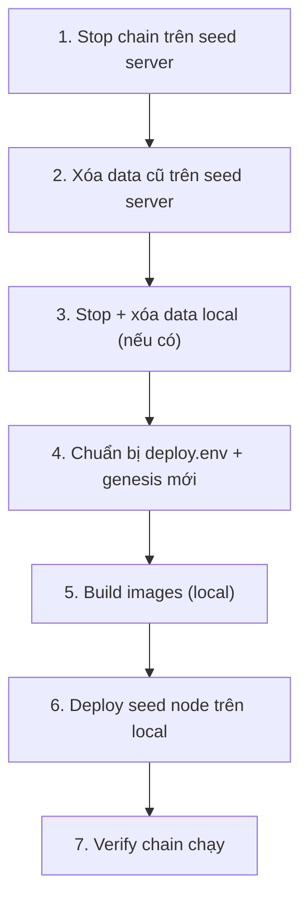

# Reset seed node (remote) và deploy lại trên local

Hướng dẫn **dừng chain trên seed server**, **xóa data cũ**, rồi **deploy lại seed node (validator-1) trên máy local**.

> Trong repo này, **seed node = validator-1** trên `SEED_SERVER` (server 1). Reset chain = **chain mới hoàn toàn** — explorer, validator phụ, DApps trên server khác cũng phải stop, xóa data và sync lại genesis mới.

**Liên quan:**

- [deploy-seed-node.md](./deploy-seed-node.md) — deploy seed node từ đầu (local + remote)
- [remote-deploy.md](./remote-deploy.md) — luồng deploy remote qua Docker Hub
- [dpos-testnet.md](./dpos-testnet.md) — deploy chain DPoS từ đầu (local)
- [custom-staking-gtbs.md](./custom-staking-gtbs.md) — GTBS custom staking (nếu bật `ENABLE_CUSTOM_STAKING=true`)

---

## Tổng quan luồng



| Phase | Việc làm | Chạy ở |
|-------|----------|--------|
| 0 | Kiểm tra `deploy.env` (SSH target) | Local |
| 1 | Stop validator stack trên seed | Local → SSH |
| 2 | Xóa chain data trên seed | SSH (seed server) |
| 3 | Stop + xóa data local | Local |
| 4 | Cấu hình + prepare genesis | Local |
| 5 | Build Docker images | Local |
| 6 | Deploy chain | Local |
| 7 | Verify | Local |

---

## Bước 0 — Chuẩn bị

```bash
cd blockchain-dock
```

Kiểm tra SSH target trong `deploy.env`:

```bash
grep -E 'SEED_SERVER|REMOTE_DEPLOY_DIR' \
  blockchain-dockerize/docker-compose/chain-dpos/envs/deploy.env
```

Ví dụ:

```env
SEED_SERVER=root@91.229.245.75
REMOTE_DEPLOY_DIR=/opt/blockchain-dock
```

---

## Bước 1 — Stop chain trên seed server (remote)

Từ **máy local** (operator):

```bash
make dpos ssh-stop-validator-nodes SEED=1
```

Hoặc chỉ định server trực tiếp:

```bash
make dpos ssh-stop-validator-nodes SERVER=root@91.229.245.75 \
  REMOTE_DIR=/opt/blockchain-dock
```

Lệnh này dừng:

- stack `compose-validator-1` (openethereum, netstats-api, validator-app)
- container deployer còn sót

> **Lưu ý:** `stop-validator-nodes.sh` **giữ chain data** trên disk. Bước 2 mới xóa data.

Nếu seed server còn chạy DApps (Traefik, netstats dashboard…), SSH vào và dừng thêm:

```bash
ssh root@91.229.245.75
cd /opt/blockchain-dock/blockchain-dockerize/docker-compose/chain-dpos
docker compose -f compose-dapps-traefik-v11.yml down
```

---

## Bước 2 — Xóa data cũ trên seed server

SSH vào seed server:

```bash
ssh root@91.229.245.75
cd /opt/blockchain-dock/blockchain-dockerize/docker-compose/chain-dpos
```

### 2a. Dừng hết + xóa Docker volumes

```bash
./scripts/stop-validator-nodes.sh --force

docker compose -f compose-validator-1.yml down -v
docker compose -f compose-dapps-traefik-v11.yml down -v   # nếu có DApps trên seed
```

### 2b. Xóa chain data trên host (bind mount)

```bash
# Chain DB validator
rm -rf nodes/validator-1/data/*

# RPC node (nếu có trên seed)
rm -rf nodes/rpc/data/*

# DApps DB (nếu có)
rm -rf data/dpos-blockscout-db/*
rm -rf data/proxy/docs/*
```

### 2c. (Tuỳ chọn) Xóa genesis đã deploy trên server

Nếu **không** deploy lại lên server này mà chỉ chuyển sang local:

```bash
rm -rf genesis/spec.json \
       genesis/contract-addresses.json \
       genesis/reserved-peers.txt \
       genesis/validator-1.enode \
       genesis/peers/
```

> **Giữ** `nodes/validator-1/keystore/` nếu muốn cùng địa chỉ validator. Xóa luôn keystore nếu muốn validator address mới (chain mới hoàn toàn).

Thoát SSH:

```bash
exit
```

---

## Bước 3 — Stop + xóa data cũ trên local

Quay về máy local:

```bash
cd blockchain-dockerize/docker-compose/chain-dpos
```

### 3a. Dừng containers local

Từ repo root:

```bash
make dpos stop-validator-nodes
```

Hoặc trong thư mục `chain-dpos`:

```bash
./scripts/stop-validator-nodes.sh --force
```

### 3b. Xóa volumes + data cũ (reset chain mới)

```bash
docker compose -f compose-validator-1.yml down -v
docker compose -f compose-dapps-traefik-v11.yml down -v

# Xóa genesis + node data đã sinh
rm -rf genesis/* nodes/validator-1 nodes/rpc envs/validator-1.env envs/validator-app.env

# Xóa DApps data local (nếu deploy full stack trước đó)
rm -rf data/dpos-blockscout-db data/proxy/docs
```

Nếu muốn **validator address mới**:

```bash
rm -rf nodes/validator-1/keystore
```

---

## Bước 4 — Cấu hình `deploy.env`

Chỉnh file cấu hình:

```bash
nano envs/deploy.env
```

Các mục quan trọng:

| Biến | Ghi chú |
|------|---------|
| `NETWORK_NAME`, `NETWORK_ID` | Đổi `NETWORK_ID` nếu muốn chain ID mới |
| `PREMINE_ADDRESS` | Phải **khác** địa chỉ validator-1 |
| `CONTRACT_TRANSITION_BLOCK` | Đủ lớn để deploy + patch kịp (vd. `100`) |
| `DOCKERHUB_NAMESPACE` | Để trống hoặc placeholder nếu dùng **images local** |
| `ENABLE_CUSTOM_STAKING=true` | Nếu deploy GTBS custom staking |

### Chuẩn bị genesis (Phase A)

Nếu dùng **GTBS**:

```bash
make dpos gtbs-prepare WITH_TRAEFIK=1
```

Script sẽ compile, test, validate tokenomics, và tạo genesis mới.

Nếu **không** GTBS:

```bash
make dpos prepare-remote
# hoặc có Traefik:
make dpos prepare-remote WITH_TRAEFIK=1
```

---

## Bước 5 — Build Docker images (local)

Deploy local cần images đã build:

```bash
cd blockchain-dock

# Chain core (bắt buộc)
make build build-chain

# Nếu deploy full DApps (explorer, faucet…)
make build build-explorer
make build build-dapps
```

Nếu bật GTBS và đổi contract, rebuild deployer:

```bash
docker build \
  -f blockchain-docker-base/docker/Dockerfile.dpos-deployer \
  -t dpos-deployer:0.0.1 \
  blockchain-docker-base
```

---

## Bước 6 — Deploy seed node trên local

### Option A — Chỉ chain (validator-1, không DApps)

```bash
make dpos deploy CHAIN_ONLY=1
```

Tương đương Phase A→F: `prepare-genesis` → bootstrap → deploy contracts → patch spec → verify.

### Option B — Full stack (chain + RPC + Blockscout + Traefik)

Cần domain DNS trỏ về local hoặc `/etc/hosts`:

```bash
make dpos deploy WITH_TRAEFIK=1
```

### Option C — Chạy trực tiếp trong thư mục chain-dpos

```bash
cd blockchain-dockerize/docker-compose/chain-dpos

./scripts/deploy-all.sh --chain-only
# hoặc full:
./scripts/deploy-all.sh --with-traefik
```

Quá trình bootstrap gồm:

1. **Phase A** — tạo keystore + spec phase-1
2. **Phase B** — start openethereum
3. **Phase C** — deploy contracts
4. **Phase D** — patch spec + restart
5. **Phase E** — verify transition
6. **Phase F** — start validator-app

---

## Bước 7 — Verify chain chạy OK

```bash
cd blockchain-dockerize/docker-compose/chain-dpos

# Health check
./scripts/health-check.sh

# Block number
curl -s -X POST http://127.0.0.1:8545 \
  -H 'Content-Type: application/json' \
  -d '{"jsonrpc":"2.0","method":"eth_blockNumber","params":[],"id":1}'

# Container status
docker ps --filter name=dpos
```

Xem enode seed (dùng cho node khác sau này):

```bash
make dpos enode
# hoặc
./scripts/get_enode.sh
```

Nếu GTBS:

```bash
./scripts/verify-contracts-transition.sh
./scripts/validate-tokenomics.sh
```

---

## Bước 8 — (Sau này) Deploy lại lên remote

Sau khi local chạy ổn, lưu peer bundle vào repo:

```bash
git add genesis/reserved-peers.txt \
        genesis/validator-1.enode \
        genesis/peers/ \
        genesis/contract-addresses.json \
        genesis/spec.json
```

Sync và deploy lên seed server (khi cần):

```bash
make dpos sync SEED=1
make dpos ssh-deploy-validator SEED=1 WITH_TRAEFIK=1
```

Chi tiết capture peer bundle: [remote-deploy.md](./remote-deploy.md) § Capture peer bundle.

---

## Checklist nhanh

| # | Việc | Lệnh |
|---|------|------|
| 1 | Stop remote seed | `make dpos ssh-stop-validator-nodes SEED=1` |
| 2 | SSH xóa data remote | `down -v` + `rm -rf nodes/validator-1/data/*` |
| 3 | Stop local | `make dpos stop-validator-nodes` |
| 4 | Xóa data local | `down -v` + `rm -rf genesis/* nodes/validator-1 nodes/rpc` |
| 5 | Config + genesis | `make dpos prepare-remote` hoặc `gtbs-prepare` |
| 6 | Build images | `make build build-chain` |
| 7 | Deploy local | `make dpos deploy CHAIN_ONLY=1` |
| 8 | Verify | `./scripts/health-check.sh` |

---

## Lưu ý quan trọng

1. **Các node khác** (explorer, validator-2, DApps server) vẫn trỏ genesis/enode cũ → phải stop, xóa data, sync genesis mới.
2. **`stop-validator-nodes.sh` không xóa data** — phải chạy thêm `down -v` và `rm -rf nodes/validator-1/data/*`.
3. Nếu deploy **chậm** và block vượt `CONTRACT_TRANSITION_BLOCK` trước khi patch spec → phải reset lại từ đầu.
4. Giữ `nodes/validator-1/keystore` nếu muốn cùng validator address; xóa nếu muốn address mới.
