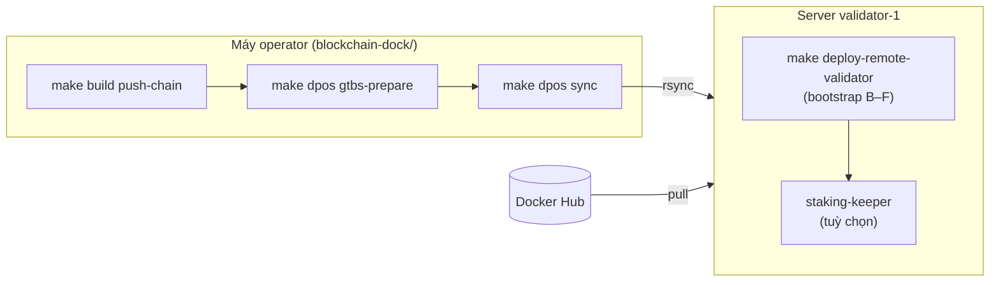

# Triển khai Validator-1 với Custom Contracts (GTBS)

Runbook operator để dựng **validator-1** trên server với bộ contract custom staking (profile GTBS): `Consensus`, `BlockReward`, `StakingVault`. Stack đầy đủ gồm **OpenEthereum + validator-app + netstats-api**.

> **Entry point:** chạy từ root monorepo `blockchain-dock/` (cần clone `blockchain-docker-base` và `blockchain-dockerize` cạnh nhau).  
> Chi tiết Makefile: [makefile.md](./makefile.md) hoặc `make help` / `make dpos help`.  
> Chain chuẩn (không custom): [remote-deploy.md](./remote-deploy.md).  
> Chi tiết contract, owner config, staking-keeper: [custom-staking-gtbs.md](./custom-staking-gtbs.md).

## Khác biệt so với chain chuẩn


|                | Chain chuẩn                           | Custom (GTBS)                                     |
| -------------- | ------------------------------------- | ------------------------------------------------- |
| Flag           | `ENABLE_CUSTOM_STAKING=false`         | `ENABLE_CUSTOM_STAKING=true`                      |
| Deploy script  | `dpos-contracts/2_deploy_contract.js` | `custom-staking-contracts/deploy-gtbs-staking.js` |
| Contracts      | Consensus + BlockReward + Voting      | + **StakingVault** (user entry point)             |
| Stake/delegate | Trực tiếp `Consensus`                 | Chỉ qua **StakingVault**                          |
| Reward         | Validator fee %                       | NET APY split (không trừ fee)                     |
| Sau deploy     | validator-app                         | validator-app + **staking-keeper** (tuỳ chọn)     |


Khi `ENABLE_CUSTOM_STAKING=false`, bootstrap **giống hệt** chain DPoS chuẩn — không ảnh hưởng các deployment khác.

## Luồng tổng quan




| Phase | Việc làm                              | Make target (từ root `blockchain-dock/`) |
| ----- | ------------------------------------- | ---------------------------------------- |
| A     | Genesis + keystore (local)            | `make dpos gtbs-prepare`                 |
| B     | Start `openethereum` + `netstats-api` | *(trong `deploy-remote-validator`)*      |
| C     | Deploy **GTBS contracts**             | *(trong `deploy-remote-validator`)*      |
| D     | Patch spec phase-2 + restart          | *(trong `deploy-remote-validator`)*      |
| E     | Verify transition                     | *(trong `deploy-remote-validator`)*      |
| F     | Export enode                          | *(trong `deploy-remote-validator`)*      |
| —     | Start `validator-app`                 | *(trong `deploy-remote-validator`)*      |


> **Ràng buộc:** Phase C + D phải xong **trước** `current_block >= CONTRACT_TRANSITION_BLOCK`.

### Map nhanh: script cũ → Make


| Script (cũ)                                              | Make (từ root `blockchain-dock/`)                      |
| -------------------------------------------------------- | ------------------------------------------------------ |
| `./scripts/build-and-push.sh --chain --push`             | `make build push-chain DOCKERHUB_NAMESPACE=...`        |
| `cp envs/deploy.env.example …`                           | `make dpos init`                                       |
| `./scripts/local/prepare-deploy.sh`                      | `make dpos gtbs-prepare`                               |
| `./scripts/local/setup-ssh.sh user@host`                 | `make dpos setup-ssh SERVER=user@host`                 |
| `./scripts/local/provision-remote.sh user@host`          | `make dpos provision-remote SERVER=user@host`          |
| `./scripts/local/sync-to-server.sh user@host`            | `make dpos sync SERVER=user@host`                      |
| `./scripts/remote/deploy-validator.sh` (từ máy operator) | `make dpos ssh-deploy-validator SERVER=user@host`      |
| `./scripts/remote/deploy-validator.sh` (trên server)     | `make deploy-remote-validator` *(trong `chain-dpos/`)* |


---

## Chuẩn bị

```bash
cd blockchain-dock
make check          # docker, compose v2, jq, node
make dpos help      # xem toàn bộ target DPoS
make build help     # xem target build images
```

Yêu cầu: GNU Make 4+, Docker 20.10+, Docker Compose v2, `jq`, Node.js 18+, **SSH key** tới server (`make dpos setup-ssh SERVER=user@host`).

---

## Bước 0 — SSH key (một lần)

```bash
ssh-keygen -t ed25519   # nếu chưa có ~/.ssh/id_ed25519.pub
make dpos setup-ssh SERVER=ubuntu@<server-1>
```

Sau bước này, `provision-remote` / `sync` / `ssh-deploy-validator` không hỏi password SSH nữa.

---

## Bước 1 — Build & push images

Image `dpos-deployer` embed cả `dpos-contracts` và `custom-staking-contracts`. Deployer chọn nhánh deploy theo biến `ENABLE_CUSTOM_STAKING` lúc chạy container.

```bash
cd blockchain-dock
make build login
make build push-chain DOCKERHUB_NAMESPACE=<dockerhub-user>
```

Images cần cho validator-1 (nằm trong nhóm `chain`):


| Image                           | Vai trò                         |
| ------------------------------- | ------------------------------- |
| `blockchain-dock-openethereum`  | Node validator                  |
| `blockchain-dock-validator-app` | Gửi cycle txs sau transition    |
| `blockchain-dock-netstats-api`  | Báo cáo metrics lên dashboard   |
| `blockchain-dock-dpos-deployer` | Deploy GTBS contracts (phase C) |


Nếu sửa Solidity trong `custom-staking-contracts/`, **bắt buộc** rebuild và push lại:

```bash
make build build-chain
make build push-chain DOCKERHUB_NAMESPACE=<dockerhub-user>
```

---

## Bước 2 — Cấu hình `deploy.env` (máy operator)

```bash
cd blockchain-dock
make dpos init
```

Chỉnh file `blockchain-dockerize/docker-compose/chain-dpos/envs/deploy.env`.

### 2.1 Bật custom staking

```env
# Bắt buộc cho GTBS
ENABLE_CUSTOM_STAKING=true

# Docker Hub — namespace đã push ở bước 1
DOCKERHUB_NAMESPACE=<dockerhub-user>

# Chain identity
NETWORK_NAME=GTBS-Testnet
NETWORK_ID=0x...
NETWORK_TYPE=testnet
BLOCK_TIME_SECONDS=5
CONTRACT_TRANSITION_BLOCK=100
PREMINE_ADDRESS=0x...
PREMINE_BALANCE_WEI=...
VALIDATOR_BALANCE_WEI=...
INITIAL_SUPPLY_GWEI=...
```

### 2.2 Tham số GTBS (tuỳ chọn — override `gtbs-staking.env`)

Các biến sau được `render-envs.sh` copy từ `gtbs-staking.env.example` và ghi đè khi set trong `deploy.env`:


| Biến                               | Mô tả                  | Mặc định (example) |
| ---------------------------------- | ---------------------- | ------------------ |
| `MAX_STAKE_TOKENS`                 | Stake tối đa validator | `300000000`        |
| `MIN_DELEGATION_TOKENS`            | Delegate tối thiểu     | `10000`            |
| `MAX_DELEGATION_PER_WALLET_TOKENS` | Cap delegate / ví      | `100000`           |
| `NET_APY_PERCENT`                  | NET APY delegator      | `4`                |
| `ANNUAL_UNLOCK_CAP_TOKENS`         | Cap unlock/năm         | `500000`           |
| `UNSTAKE_FEE_BPS`                  | Phí unstake (bps)      | `1000`             |
| `DELEGATOR_LOCK_DAYS`              | Lock delegate          | `180`              |
| `ANNUAL_UNLOCK_PERIOD_DAYS`        | Chu kỳ vesting         | `365`              |
| `RELEASE_DELAY_DAYS`               | Delay trước release    | `30`               |


Ví dụ thêm vào `deploy.env`:

```env
MAX_STAKE_TOKENS=300000000
MIN_DELEGATION_TOKENS=10000
MAX_DELEGATION_PER_WALLET_TOKENS=100000
NET_APY_PERCENT=4
```

### 2.3 Explorer GTBS (tuỳ chọn, deploy DApps sau)

```env
EXPLORER_CUSTOM_PROFILE=gtbs
EXPLORER_HERO_TITLE=GTBS Blockchain Explorer
```

Xem [explorer-custom-theme.md](./explorer-custom-theme.md).

---

## Bước 3 — Chuẩn bị genesis (local)

Target `gtbs-prepare` kiểm tra `ENABLE_CUSTOM_STAKING=true`, rồi chạy `prepare-deploy.sh`:

1. `render-envs.sh` — derive `INITIAL_SUPPLY_GWEI`, `BLOCKS_PER_YEAR`, `MAX_SUPPLY_WEI`
2. `generate-gtbs-contract-config.js` — patch `BlockReward.sol` / `ConsensusUtils.sol` từ env
3. `npm run compile && npm test` trong `custom-staking-contracts`
4. `validate-tokenomics.sh` — grep patched constants + env math
5. `prepare-genesis.sh` — premine = `PREMINE_BALANCE_WEI`

**Re-init chain mới:** xóa DB chain + `genesis/contract-addresses.json` trước bootstrap.

```bash
cd blockchain-dock
make dpos gtbs-prepare
# Nếu sau này deploy DApps + Traefik trên cùng server:
# make dpos gtbs-prepare WITH_TRAEFIK=1
```

Xác nhận:

```bash
cat blockchain-dockerize/docker-compose/chain-dpos/genesis/validator-1.address
ls blockchain-dockerize/docker-compose/chain-dpos/envs/gtbs-staking.env
```

---

## Bước 4 — Provision & sync lên server

**Provision server (một lần):**

```bash
cd blockchain-dock
make dpos provision-remote SERVER=ubuntu@<server-1>
```

**Sync bundle:**

```bash
make dpos sync SERVER=ubuntu@<server-1>
# Tuỳ chọn đổi thư mục đích:
# make dpos sync SERVER=ubuntu@<server-1> REMOTE_DIR=/opt/blockchain-dock
```

Đồng bộ: genesis, keystore, env, compose, scripts. Source contract nằm trong image `dpos-deployer` trên Hub — **không** cần copy source lên server.

---

## Bước 5 — Deploy validator-1 trên server

### Cách A — Từ máy operator (SSH một lệnh)

```bash
cd blockchain-dock
make dpos ssh-deploy-validator SERVER=ubuntu@<server-1>
# Với Traefik/DApps sau này trên cùng server:
# make dpos ssh-deploy-validator SERVER=ubuntu@<server-1> WITH_TRAEFIK=1
```

### Cách B — SSH vào server rồi chạy Make

```bash
ssh ubuntu@<server-1>
cd /opt/blockchain-dock/blockchain-dockerize/docker-compose/chain-dpos
make deploy-remote-validator
```

**Lần đầu** (bootstrap phase B–F + full stack), script `deploy-validator.sh` tự động:

1. `render-envs.sh` — resolve image từ Docker Hub
2. `bootstrap-chain.sh --skip-genesis` — phase B–F, deployer dùng GTBS vì `ENABLE_CUSTOM_STAKING=true`
3. `export-validator-app-env.sh` — lấy `consensusProxy` / `blockRewardProxy` từ `genesis/contract-addresses.json`
4. `docker compose -f compose-validator-1.yml --profile consensus up -d`

### Container chạy trên validator-1


| Container                            | Service       |
| ------------------------------------ | ------------- |
| `dpos-<network_type>-validator-1`    | OpenEthereum  |
| `dpos-<network_type>-netstats-api-1` | Netstats API  |
| `dpos-validator-app-1`               | Validator app |


### Kiểm tra sau deploy

Trên server (`chain-dpos/`):

```bash
make validator-logs          # theo dõi log (Ctrl+C thoát)
docker compose -f compose-validator-1.yml --profile consensus ps

# Contract addresses (có stakingVault khi GTBS)
jq . genesis/contract-addresses.json

# Flattened contracts + Blockscout verify reference (GTBS, sau deploy)
ls genesis/flats/
jq .blockscoutVerify.initializeParams genesis/gtbs-deploy-manifest.json

# Enode cho validator-2 / RPC peers
cat genesis/validator-1.enode
# hoặc: make enode

# Capture peer bundle về máy operator (một lần, sau deploy thành công)
# make pull-peer-config SERVER=ubuntu@<server-1> REMOTE_DIR=/opt/blockchain-dock
# → commit genesis/reserved-peers.txt, genesis/peers/, genesis/validator-1.enode
# Chi tiết: remote-deploy.md § Capture peer bundle

# Verify transition (nếu cần chạy lại thủ công)
make verify
```

**Khởi động lại** (đã bootstrap, không chạy lại phase B–F):

```bash
./scripts/remote/deploy-validator.sh --skip-bootstrap
```

> Chưa có Make target cho `--skip-bootstrap`; dùng script trực tiếp hoặc `make validator-up` nếu chỉ cần bật lại container.

---

## Bước 6 — Staking-keeper (tuỳ chọn, sau transition)

Bot tự gọi `completeUnstake` khi hết `releaseDelayPeriod`. Cần wallet bot có gas.

Tạo `envs/staking-keeper.env` trên server (hoặc local rồi `make dpos sync`):

```env
RPC_URL=http://host.docker.internal:8545
STAKING_VAULT_ADDRESS=<từ genesis/contract-addresses.json → .stakingVault>
BOT_PRIVATE_KEY=<private key ví bot>
POLLING_INTERVAL=300000
FROM_BLOCK=0
GAS=500000
LOG_LEVEL=info
```

Trên server:

```bash
cd /opt/blockchain-dock/blockchain-dockerize/docker-compose/chain-dpos
docker compose -f compose-custom-staking.yml --profile custom-staking up -d staking-keeper
```

> Image `staking-keeper` dùng tag local `staking-keeper:0.0.1` (chưa có trong `build-and-push.sh`). Tạm thời chạy trên host:

```bash
cd blockchain-docker-base/resources/staking-keeper
cp ../../../blockchain-dockerize/docker-compose/chain-dpos/envs/staking-keeper.env .env
npm install && npm start
```

---

## Deploy local (không qua server)

Trên máy có full repo `blockchain-dock/`:

```bash
cd blockchain-dock
# deploy.env: ENABLE_CUSTOM_STAKING=true, DOCKERHUB_NAMESPACE hoặc build local
make dpos gtbs-prepare
make dpos bootstrap
make dpos validator-up
```

Hoặc gộp một lệnh (local all-in-one, chỉ chain):

```bash
make dpos deploy-chain
```

Full chain + DApps + Traefik:

```bash
make dpos deploy WITH_TRAEFIK=1
```

---

## Firewall & cổng


| Cổng          | Mục đích                                                |
| ------------- | ------------------------------------------------------- |
| 30300 TCP/UDP | P2P — mở public nếu có validator-2                      |
| 8545          | RPC — chỉ `127.0.0.1` trên host (không public internet) |
| 3006          | Netstats API — nội bộ                                   |


Netstats **dashboard** (UI) chạy ở bước DApps (`make dpos ssh-deploy-dapps`), không nằm trên validator.

---

## Troubleshooting

### Deployer chạy script chuẩn thay vì GTBS

- Kiểm tra `ENABLE_CUSTOM_STAKING=true` trong `envs/deploy.env` **trước** `make dpos gtbs-prepare`
- Trên server: `grep ENABLE_CUSTOM_STAKING envs/deploy.env`
- Image `dpos-deployer` phải là bản mới có `/gtbs/` (rebuild: `make build push-chain`)

### `contract-addresses.json` thiếu `stakingVault`

- Deploy GTBS thất bại hoặc chưa chạy phase C
- Xem log: `docker logs dpos-deployer`

### Quá `CONTRACT_TRANSITION_BLOCK` mà chưa patch spec

- Chain không recover — tạo chain mới, tăng `CONTRACT_TRANSITION_BLOCK` hoặc rút ngắn `BLOCK_TIME_SECONDS` khi test

### `validator-app` không start / lỗi contract

- Chờ transition xong: `make verify` (trên server trong `chain-dpos/`)
- Kiểm tra `envs/validator-app.env` có đúng proxy addresses
- Chạy lại: `./scripts/export-validator-app-env.sh` rồi `make validator-up`

### Stake trực tiếp `Consensus` revert

- Đúng với GTBS — user phải gọi **StakingVault**

---

## Checklist

- `make check` pass trên máy operator
- `ENABLE_CUSTOM_STAKING=true` trong `envs/deploy.env`
- `make build push-chain DOCKERHUB_NAMESPACE=...` hoàn tất
- `make dpos gtbs-prepare` + `make dpos sync SERVER=...` hoàn tất
- `make dpos ssh-deploy-validator SERVER=...` — 3 container running
- `genesis/contract-addresses.json` có `consensusProxy`, `blockRewardProxy`, `stakingVault`
- `make verify` pass
- `genesis/validator-1.enode` exported
- (Tuỳ chọn) `staking-keeper` với `STAKING_VAULT_ADDRESS` đúng
- (Tuỳ chọn) DApps: `make dpos ssh-deploy-dapps SERVER=...` + `EXPLORER_CUSTOM_PROFILE=gtbs`

---

## Liên quan


| Tài liệu                                               | Nội dung                                              |
| ------------------------------------------------------ | ----------------------------------------------------- |
| [makefile.md](./makefile.md)                           | Toàn bộ target Make, biến `SERVER`, `WITH_TRAEFIK`, … |
| [remote-deploy.md](./remote-deploy.md)                 | Luồng deploy server qua Docker Hub                    |
| [custom-staking-gtbs.md](./custom-staking-gtbs.md)     | Contract GTBS, owner config, tests                    |
| [dpos-testnet.md](./dpos-testnet.md)                   | Phase A–F chi tiết, biến env chain                    |
| [netstats.md](./netstats.md)                           | Cấu hình netstats-api / dashboard                     |
| [explorer-custom-theme.md](./explorer-custom-theme.md) | Explorer profile GTBS                                 |


